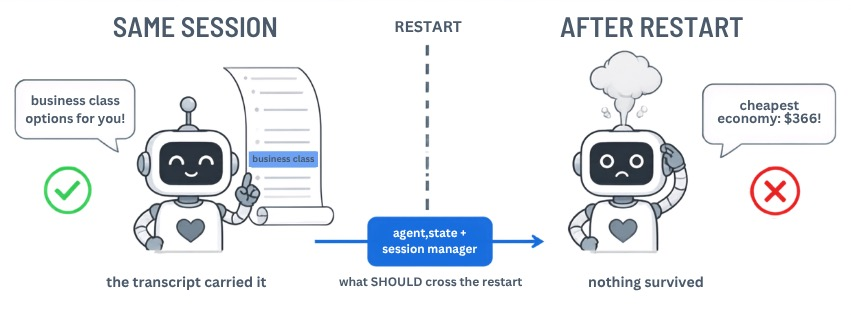
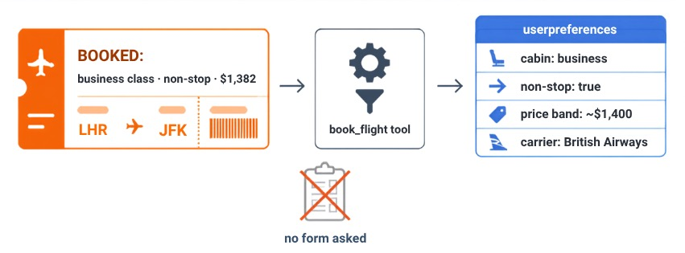

# Stop Your AI Agent from Forgetting User Preferences: Key-Value Memory (Agent State)

**Problem:** AI agents forget user preferences between sessions, treating every returning user as a stranger. Within one session the conversation transcript papers over it — but the transcript is unstructured, gets trimmed as it grows, and dies with the process. (The research literature calls this *memory decay*.)

**Solution:** The simplest agent memory — a **key-value store** (Strands calls it [agent state](https://strandsagents.com/docs/user-guide/concepts/agents/state/?trk=87c4c426-cddf-4799-a299-273337552ad8&sc_channel=el)): structured facts under named keys, no embeddings, no similarity search. Climb its durability ladder: `agent.state` (process) → `FileSessionManager` (local disk) → `S3SessionManager` (Amazon S3, plain JSON objects — production).

Based on research:
- [MemoryOS of AI Agent](https://arxiv.org/abs/2506.06326) — Kang et al., 2025
- [Cognitive Memory in Large Language Models](https://arxiv.org/abs/2504.02441) — Shan et al., 2025

This demo implements memory patterns using [Strands Agents SDK](https://github.com/strands-agents/sdk-python). The patterns are framework-agnostic and carry over to other agent frameworks.

---

## What This Demo Shows

### Real-World Scenario: Flight Assistant with Live Data

A brand-new user arrives with **empty memory** and talks to a flight assistant. Every search hits the **real Duffel sandbox API** (live offers, real carriers, real prices) and climate questions hit **Open-Meteo** (real historical data) — nothing is hardcoded:

1. **Turn 1** — User searches JFK → Paris CDG, business class
2. **Turn 2** — User books the cheapest business option ← *the memory moment*
3. **Turn 3** — User asks for CDG → Tokyo "based on what you know about me"
4. **The restart** — a brand-new agent instance gets the same turn-3 question

**Why this matters:**
- Within one session, even a memory-less agent answers turn 3 — the transcript (`agent.messages`) still contains "business class". That's not learning: no structured profile exists, and it can't be queried, ranked by, or persisted
- After a restart (every new process or request in production), the memory-less agent answers the same question generically — everything it "knew" died with the transcript
- Users expect personalization across sessions — repeating preferences to a returning-user assistant is frustrating



The APIs are scenery: **the experiment is where memory lives**, and that's the only variable that changes between tests.

---

## Scenarios Demonstrated

| Scenario | Approach | Structured profile | Cross-session | Personalized |
|----------|----------|--------------------|---------------|-------------|
| **1. Stateless** | No memory tools (transcript only) | No | No | Only while the transcript lasts |
| **2. Stateful** | `agent.state` tools | Yes | No | Yes |
| **3. Persistent** | + `FileSessionManager` (local disk) | Yes | Yes | Yes |
| **4. Cloud** | + `S3SessionManager` (Amazon S3) | Yes | Yes | Yes |

---

## Quick Start

### Prerequisites

- Python 3.9+ (check with: `python --version`)
- Credentials for an AI model provider. The demo runs with **OpenAI** by default, but you can use **Amazon Bedrock**, **Anthropic**, or any provider available in the Strands configuration — see [supported model providers](https://strandsagents.com/docs/user-guide/concepts/model-providers/?trk=87c4c426-cddf-4799-a299-273337552ad8&sc_channel=el).

**Option A — OpenAI (default).** Get an API key [here](https://platform.openai.com/api-keys) and set it (choose your platform):

**Unix/Linux/macOS:**
```bash
export OPENAI_API_KEY="your-key-here"
```

**Windows (Command Prompt):**
```cmd
set OPENAI_API_KEY=your-key-here
```

**Windows (PowerShell):**
```powershell
$env:OPENAI_API_KEY="your-key-here"
```

**All platforms:** You can also add `OPENAI_API_KEY=your-key-here` to a `.env` file in the project directory — see [python-dotenv](https://pypi.org/project/python-dotenv/).

**Option B — Amazon Bedrock.** No OpenAI key needed — uses your AWS credentials (`aws configure`, with [model access enabled](https://docs.aws.amazon.com/bedrock/latest/userguide/model-access.html?trk=87c4c426-cddf-4799-a299-273337552ad8&sc_channel=el) in your region). In `test_key_value_memory.py` (or the notebook's setup cell), comment out the `OpenAIModel` line and uncomment the Bedrock block:

```python
# MODEL = OpenAIModel(model_id="gpt-4o-mini")
from strands.models import BedrockModel
MODEL = BedrockModel(model_id="openai.gpt-oss-120b-1:0", region_name="us-west-2")
```

Any other Strands-supported provider (Anthropic, Ollama, ...) works the same way: swap the model object in that one place.

**Flight data — `DUFFEL_API_KEY` (free).** The search tools call the [Duffel](https://duffel.com) sandbox for live offers. Create a free test token at [app.duffel.com](https://app.duffel.com) (More → Developers → Access tokens) and add it to your `.env`:

```bash
DUFFEL_API_KEY=duffel_test_...
```

Climate data ([Open-Meteo](https://open-meteo.com), CC-BY 4.0; geocoding by GeoNames) needs no key. If the Duffel sandbox is briefly unreachable, the demo falls back to offers captured once from the live API (`fallback_offers.json`) — real data either way.

**Test 4 (optional) — Amazon S3 session storage.** Set AWS credentials (`aws configure`) and choose a bucket name in `.env` — **the demo creates the bucket if it doesn't exist** (private, public access blocked):

```bash
SESSIONS_BUCKET=your-bucket-name
```

Test 4 persists the same key-value session as plain JSON objects in S3 (`S3SessionManager` — regular S3, no vectors). Without `SESSIONS_BUCKET`, Tests 1-3 still run and Test 4 skips gracefully.

### Installation

We use [uv](https://docs.astral.sh/uv/) (a fast Python package installer and resolver) for dependency management. If you prefer using pip, you can run `pip install -r requirements.txt` instead. Install uv with `curl -LsSf https://astral.sh/uv/install.sh | sh` or see [uv installation guide](https://docs.astral.sh/uv/getting-started/installation/).

Install dependencies (choose your platform):

**Unix/Linux/macOS:**
```bash
uv venv && uv pip install -r requirements.txt
```

**Windows (Command Prompt):**
```cmd
uv venv
uv pip install -r requirements.txt
```

**Windows (PowerShell):**
```powershell
uv venv; uv pip install -r requirements.txt
```

### Run Demo

```bash
# Run all 4 tests with comparison table
uv run python test_key_value_memory.py

# Jupyter notebook (interactive)
# Open test_key_value_memory.ipynb in Jupyter, JupyterLab, VS Code, or your preferred notebook environment
```

---

## Files

| File | Purpose |
|------|---------|
| `test_key_value_memory.py` | Main demo — runs 4 scenarios with comparison |
| `test_key_value_memory.ipynb` | Interactive notebook with explanations |
| `tools.py` | Stateless and stateful tool definitions (research-backed docstrings) |
| `flights_api.py` | Duffel sandbox client — live offers + captured fallback |
| `weather_api.py` | Open-Meteo client — real monthly climate averages |
| `fallback_offers.json` | Offers captured once from the live sandbox (offline resilience) |
| `requirements.txt` | Dependencies |

---

## How It Works

### Stateless Tool (no memory)

```python
@tool
def search_flights_stateless(origin: str, destination: str, departure_date: str,
                             cabin_class: str = "economy") -> str:
    """Search live flight offers when the user wants to fly somewhere on a date. ..."""
    offers = flights_api.search_offers(origin, destination, departure_date, cabin_class)
    return json.dumps(offers)   # Real offers — but no state is written; only the
                                # transcript "remembers", and it dies with the process
```

### Stateful Tool (agent.state memory)

```python
@tool(context=True)
def book_flight(offer_id: str, tool_context: ToolContext) -> str:
    """Confirm a booking AND learn the user's preferences from their choice. ..."""
    offer = flights_api.get_offer(offer_id)          # The REAL chosen offer

    # The booking action reveals preferences — write them to agent.state
    prefs = tool_context.agent.state.get("user_preferences") or {}
    prefs["preferred_cabin"] = offer["cabin"]                     # "business"
    prefs["prefers_nonstop"] = all(s["stops"] == 0 for s in offer["slices"])
    tool_context.agent.state.set("user_preferences", prefs)
```



Tool docstrings follow the research-backed pattern ([ToolLLM](https://arxiv.org/abs/2307.16789), [AgentTuning](https://arxiv.org/abs/2310.12823)): first sentence says *when* to use the tool, trigger phrases listed, return shape documented — so the system prompt never has to re-describe the tools.

### Session Persistence

```python
from strands.session import FileSessionManager, S3SessionManager

# Local disk (development):
agent = Agent(
    model=MODEL,
    tools=[search_flights, book_flight],
    session_manager=FileSessionManager(
        session_id="traveler-demo",   # Same ID = same user
        storage_dir="./sessions",
    ),
)

# Amazon S3 (production — nothing to provision or mount, unlike EFS on Lambda/Fargate;
# any compute instance can restore the session):
agent = Agent(
    model=MODEL,
    tools=[search_flights, book_flight],
    session_manager=S3SessionManager(
        session_id="traveler-demo",
        bucket="your-bucket-name",    # Plain JSON objects — regular S3, no vectors
        prefix="kv-memory-demo",
    ),
)
# agent.state is automatically restored from the previous session either way
```

---

## Key Concepts

### Memory Hierarchy (from MemoryOS paper)

| Layer | Strands equivalent | Scope |
|-------|-------------------|-------|
| Short-term | `agent.messages` | Current conversation |
| Mid-term | `agent.state` | Current session |
| Long-term | `FileSessionManager` / `S3SessionManager` | Across sessions |

### When to Use Each

- **`agent.state`** — User preferences, booking history, learned patterns within a session
- **`FileSessionManager`** — Development, testing, single-server deployments
- **`S3SessionManager`** — Production, multi-server, serverless (Lambda)

---

## Learning Objectives

1. Understand why the conversation transcript is not memory — it personalizes within a session but is unstructured, trimmable, and lost on restart
2. Use `agent.state` to store and retrieve user preferences as a structured profile
3. Use `FileSessionManager` to persist state across agent restarts
4. Design tools that learn from user actions — with research-backed docstrings the agent understands without prompt help
5. Work with live APIs in agent tools (retries + captured fallback for resilience)

---

## Troubleshooting

| Issue | Solution |
|-------|---------|
| `OPENAI_API_KEY not set` | Set the key: `export OPENAI_API_KEY=your-key` |
| `DUFFEL_API_KEY not set` | Free sandbox token at [app.duffel.com](https://app.duffel.com) → More → Developers → Access tokens |
| `ModuleNotFoundError: strands` | Run `uv pip install -r requirements.txt` |
| Duffel returns no offers | Sandbox hiccup — the demo falls back to `fallback_offers.json` automatically |
| Offer expired when booking | Normal: Duffel offers expire in minutes. Search again, book a fresh `offer_id` |
| Session not restored | Verify `session_id` matches and `storage_dir` exists |
| Agent ignores preferences | Check that tools use `@tool(context=True)` and read from `agent.state` |

---

## References

### Research
- [MemoryOS of AI Agent](https://arxiv.org/abs/2506.06326) — Kang et al., 2025
- [Cognitive Memory in Large Language Models](https://arxiv.org/abs/2504.02441) — Shan et al., 2025
- [MemGPT: Towards LLMs as Operating Systems](https://arxiv.org/abs/2310.08560) — Packer et al., 2023

### Implementation Resources
- [Strands Agent State](https://github.com/strands-agents/sdk-python#agent-state) — State management API used in this demo
- [Strands Session Management](https://github.com/strands-agents/sdk-python#sessions) — Cross-session persistence

---

## Next Steps

1. [Demo 02: Vector Memory](../02-vector-memory-demo/) — put the JSON into a vector store, retrieve by meaning
2. [Demo 03: Graph Memory](../03-graph-memory-demo/) — reason over relationships, not just similarity

---

## Contributing

Contributions are welcome! See [CONTRIBUTING](../CONTRIBUTING.md) for more information.

---

## Security

If you discover a potential security issue in this project, notify AWS/Amazon Security via the [vulnerability reporting page](https://aws.amazon.com/security/vulnerability-reporting/). Please do **not** create a public GitHub issue.

---

## License

This library is licensed under the MIT-0 License. See the [LICENSE](../LICENSE) file for details.
