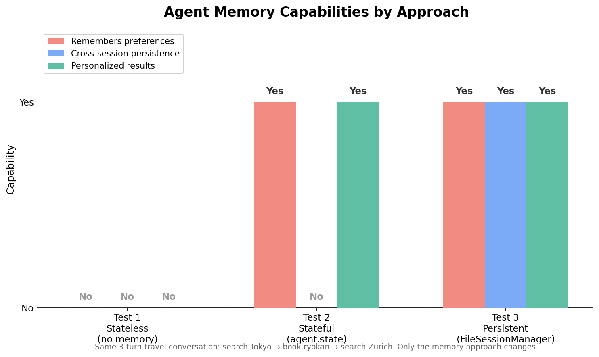

# Fix AI Agent Memory Decay: Persistent State and Session Management

**Problem:** AI agents forget user preferences between turns and sessions, treating every interaction as a new user.

**Solution:** Use `agent.state` for within-session memory and `FileSessionManager` for cross-session persistence.

Based on research:
- [MemoryOS of AI Agent](https://arxiv.org/abs/2506.06326) — Kang et al., 2025
- [Cognitive Memory in Large Language Models](https://arxiv.org/abs/2504.02441) — Shan et al., 2025

This demo implements memory patterns using [Strands Agents SDK](https://github.com/strands-agents/sdk-python). The patterns are framework-agnostic and can be applied with LangGraph, AutoGen, or other agent frameworks.

---

## What This Demo Shows

### Real-World Scenario: Travel Assistant

A travel assistant helps users search and book hotels across multiple conversations:

1. **Turn 1** — User searches hotels in Tokyo
2. **Turn 2** — User books a traditional 4-star ryokan with onsen and garden
3. **Turn 3** — User searches Zurich hotels — does the agent personalize results?

**Why this matters:**
- Without memory, the agent recommends budget hostels after a luxury booking
- Users expect personalization — repeating preferences is frustrating
- Production agents need to remember returning users across sessions


---

## Scenarios Demonstrated

| Scenario | Approach | Remembers preferences | Cross-session | Personalized |
|----------|----------|----------------------|---------------|-------------|
| **1. Stateless** | No memory tools | No | No | No |
| **2. Stateful** | `agent.state` tools | Yes | No | Yes |
| **3. Persistent** | `agent.state` + `FileSessionManager` | Yes | Yes | Yes |



---

## Quick Start

### Prerequisites

- Python 3.9+ (check with: `python --version`)
- OpenAI API key ([get yours here](https://platform.openai.com/api-keys))

Set your API key (choose your platform):

**Unix/Linux/macOS:**
```bash
export OPENAI_API_KEY="your-key-here"
```

**Windows (Command Prompt):**
```cmd
set OPENAI_API_KEY=your-key-here
```

**Windows (PowerShell):**
```powershell
$env:OPENAI_API_KEY="your-key-here"
```

**All platforms:** You can also add `OPENAI_API_KEY=your-key-here` to a `.env` file in the project directory — see [python-dotenv](https://pypi.org/project/python-dotenv/).

You can use different AI model providers (like Amazon Bedrock or Anthropic Claude) instead of OpenAI. See [supported model providers](https://strandsagents.com/docs/user-guide/concepts/model-providers/) for details.

### Installation

We use [uv](https://docs.astral.sh/uv/) (a fast Python package installer and resolver) for dependency management. If you prefer using pip, you can run `pip install -r requirements.txt` instead. Install uv with `curl -LsSf https://astral.sh/uv/install.sh | sh` or see [uv installation guide](https://docs.astral.sh/uv/getting-started/installation/).

Install dependencies (choose your platform):

**Unix/Linux/macOS:**
```bash
uv venv && uv pip install -r requirements.txt
```

**Windows (Command Prompt):**
```cmd
uv venv
uv pip install -r requirements.txt
```

**Windows (PowerShell):**
```powershell
uv venv; uv pip install -r requirements.txt
```

### Run Demo

```bash
# Run all 3 tests with comparison table
uv run python test_memory_decay.py

# Jupyter notebook (interactive)
# Open test_memory_decay.ipynb in Jupyter, JupyterLab, VS Code, or your preferred notebook environment
```

---

## Files

| File | Purpose |
|------|---------|
| `test_memory_decay.py` | Main demo — runs 3 scenarios with comparison |
| `test_memory_decay.ipynb` | Interactive notebook with explanations |
| `tools.py` | Stateless and stateful tool definitions |
| `requirements.txt` | Dependencies |

---

## How It Works

### Stateless Tool (no memory)

```python
@tool
def search_hotels_stateless(city: str, max_price: int = 9999) -> str:
    """Returns results with no personalization."""
    results = [h for h in HOTELS if h["city"].lower() == city.lower()]
    return json.dumps(results)  # Generic results every time
```

### Stateful Tool (agent.state memory)

```python
@tool(context=True)
def book_hotel(hotel_name: str, tool_context: ToolContext, nights: int = 1) -> str:
    """Books hotel and LEARNS user preferences."""
    hotel = find_hotel(hotel_name)

    # Write to agent.state — persists across turns
    prefs = tool_context.agent.state.get("user_preferences") or {}
    prefs["preferred_style"] = hotel["style"]       # "traditional"
    prefs["preferred_stars"] = hotel["stars"]         # 4
    prefs["preferred_amenities"] = hotel["amenities"] # ["onsen", "garden"]
    tool_context.agent.state.set("user_preferences", prefs)
```

### Session Persistence

```python
from strands.session import FileSessionManager

agent = Agent(
    model=MODEL,
    tools=[search_hotels, book_hotel],
    session_manager=FileSessionManager(
        session_id="user-42",       # Same ID = same user
        storage_dir="./sessions"    # Or use S3SessionManager for production
    ),
)
# agent.state is automatically restored from the previous session
```

---

## Key Concepts

### Memory Hierarchy (from MemoryOS paper)

| Layer | Strands equivalent | Scope |
|-------|-------------------|-------|
| Short-term | `agent.messages` | Current conversation |
| Mid-term | `agent.state` | Current session |
| Long-term | `FileSessionManager` / `S3SessionManager` | Across sessions |

### When to Use Each

- **`agent.state`** — User preferences, booking history, learned patterns within a session
- **`FileSessionManager`** — Development, testing, single-server deployments
- **`S3SessionManager`** — Production, multi-server, serverless (Lambda)

---

## Learning Objectives

1. Understand why stateless agents cannot personalize
2. Use `agent.state` to store and retrieve user preferences across turns
3. Use `FileSessionManager` to persist state across agent restarts
4. Design tools that explicitly learn from user actions
5. Connect memory decay to the Core Memory pattern (Demo 02)

---

## Troubleshooting

| Issue | Solution |
|-------|---------|
| `OPENAI_API_KEY not set` | Set the key: `export OPENAI_API_KEY=your-key` |
| `ModuleNotFoundError: strands` | Run `uv pip install -r requirements.txt` |
| Session not restored | Verify `session_id` matches and `storage_dir` exists |
| Agent ignores preferences | Check that tools use `@tool(context=True)` and read from `agent.state` |

---

## References

### Research
- [MemoryOS of AI Agent](https://arxiv.org/abs/2506.06326) — Kang et al., 2025
- [Cognitive Memory in Large Language Models](https://arxiv.org/abs/2504.02441) — Shan et al., 2025
- [MemGPT: Towards LLMs as Operating Systems](https://arxiv.org/abs/2310.08560) — Packer et al., 2023

### Implementation Resources
- [Strands Agent State](https://github.com/strands-agents/sdk-python#agent-state) — State management API used in this demo
- [Strands Session Management](https://github.com/strands-agents/sdk-python#sessions) — Cross-session persistence

---

## Next Steps

1. [Demo 02: Core Memory Pattern](../02-core-memory-demo/) — Structured memory with explicit read/write/update operations
2. [Demo 03: Memory Retrieval](../03-memory-retrieval-demo/) — Semantic search when memory grows large

---

## License

MIT-0 License
