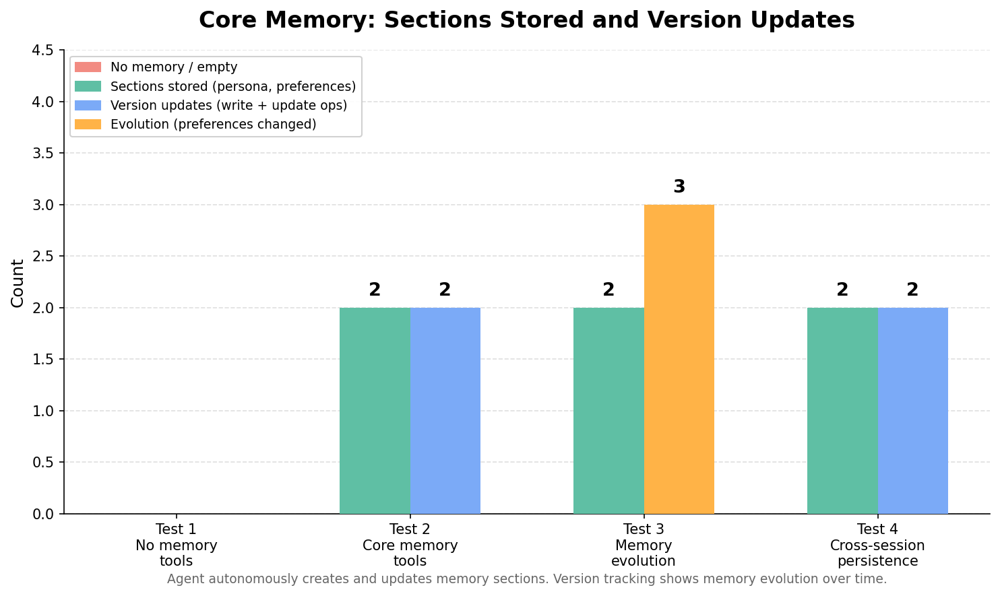

# Fix AI Agent Memory Loss: Core Memory Pattern (MIRIX/MemGPT)

**Problem:** AI agents have no mechanism to build and maintain a structured user profile across interactions.

**Solution:** Core Memory Pattern — give the agent explicit tools to read, write, update, and list its own memory sections.

Based on research:
- [MIRIX: Multi-Agent Memory System](https://arxiv.org/abs/2507.07957) — Wang & Chen, 2025
- [MemGPT: Towards LLMs as Operating Systems](https://arxiv.org/abs/2310.08560) — Packer et al., 2023
- [Enabling Personalized Long-term Interactions](https://arxiv.org/abs/2510.07925) — Westhaeusser et al., 2025

This demo implements the Core Memory pattern using [Strands Agents SDK](https://github.com/strands-agents/sdk-python). The pattern is framework-agnostic and can be applied with LangGraph, AutoGen, or other agent frameworks.

---

## What This Demo Shows

### Core Memory = Agent-Managed Structured Memory

Instead of implicit state (Demo 01), the agent has explicit tools to manage its own memory:

| Tool | Purpose |
|------|---------|
| `core_memory_read(section)` | Read a named memory section |
| `core_memory_write(section, content)` | Create a new section |
| `core_memory_update(section, updates)` | Merge updates into existing section |
| `core_memory_list()` | List all sections with metadata |

### Memory Sections (inspired by MIRIX's 6 memory types)

| Section | Content | Example |
|---------|---------|---------|
| `persona` | Who the user is | `{"name": "Alex", "role": "traveler"}` |
| `preferences` | Learned preferences | `{"style": "traditional", "stars": 4}` |
| `history` | Past interactions | `[{"hotel": "Zen Garden", "city": "Tokyo"}]` |
| `instructions` | User-specified rules | `"Always suggest pet-friendly options"` |

**Key insight:** The agent decides WHEN to store and retrieve information — it manages memory like a human.


---

## Scenarios Demonstrated

| Scenario | Approach | Core memory | Evolves | Persists |
|----------|----------|-------------|---------|----------|
| **1. Baseline** | No memory tools | Empty | — | — |
| **2. Core memory** | Read/write/update tools | Populated | — | — |
| **3. Evolution** | Preferences change | Updated | Yes | — |
| **4. Persistence** | FileSessionManager | Restored | Yes | Yes |



---

## Quick Start

### Prerequisites

```bash
# Python 3.9+ (check with: python --version)
python --version

# OpenAI API key (get yours at https://platform.openai.com/api-keys)
export OPENAI_API_KEY="your-key-here"
# Tip: you can also add this to a .env file — see https://pypi.org/project/python-dotenv/
```

**AI Model Provider** — This demo uses OpenAI by default. You can also use [Amazon Bedrock](https://aws.amazon.com/bedrock/), Anthropic, or Ollama. See [supported model providers](https://strandsagents.com/docs/user-guide/concepts/model-providers/) for setup instructions.

### Installation

```bash
# Unix/Linux/macOS
uv venv && uv pip install -r requirements.txt

# Windows Command Prompt
uv venv
uv pip install -r requirements.txt
```

### Run Demo

```bash
# Run all 4 tests with comparison table
uv run python test_core_memory.py

# Jupyter notebook (interactive)
# Open test_core_memory.ipynb in Jupyter, JupyterLab, VS Code, or your preferred notebook environment
```

---

## Files

| File | Purpose |
|------|---------|
| `test_core_memory.py` | Main demo — 4 scenarios with comparison |
| `test_core_memory.ipynb` | Interactive notebook with explanations |
| `tools.py` | Core memory tools + hotel tools |
| `requirements.txt` | Dependencies |

---

## How It Works

### The Agent's System Prompt Drives Memory Management

```python
SYSTEM_PROMPT = (
    "You are a travel assistant with core memory capabilities. "
    "IMPORTANT memory management rules:"
    "\n1. When a user shares personal info, WRITE it to 'persona' section"
    "\n2. When a user books something, UPDATE 'preferences' with learned preferences"
    "\n3. Before searching, READ 'preferences' to personalize results"
)
```

### Core Memory Write

```python
@tool(context=True)
def core_memory_write(section: str, content: str, tool_context: ToolContext) -> str:
    memory = tool_context.agent.state.get("core_memory") or {}
    memory[section] = {
        "data": json.loads(content),
        "created_at": datetime.now().isoformat(),
        "version": 1,
    }
    tool_context.agent.state.set("core_memory", memory)
```

### Core Memory Update (merge, not overwrite)

```python
@tool(context=True)
def core_memory_update(section: str, updates: str, tool_context: ToolContext) -> str:
    memory = tool_context.agent.state.get("core_memory") or {}
    existing = memory[section]
    existing["data"].update(json.loads(updates))  # Merge
    existing["version"] += 1
    tool_context.agent.state.set("core_memory", memory)
```

---

## Key Concepts

### MIRIX Memory Types mapped to Core Memory Sections

| MIRIX Type | Core Memory Section | Purpose |
|-----------|-------------------|---------|
| Core Memory | `persona` | Identity and fundamental traits |
| Episodic Memory | `history` | Past events and interactions |
| Semantic Memory | `preferences` | Learned knowledge and preferences |
| Procedural Memory | `instructions` | How-to rules and constraints |
| Resource Memory | (agent.state keys) | Large data pointers (Demo 01 pattern) |
| Knowledge Vault | (external DB) | Beyond this demo's scope |

### Why Agent-Managed > Implicit

In Demo 01, tools automatically write preferences. In Demo 02, the **agent decides** what to remember:
- More flexible — agent can store any kind of information
- More transparent — memory operations are visible in the conversation
- More controllable — system prompt guides memory strategy
- More aligned with MIRIX/MemGPT architecture

---

## Learning Objectives

1. Understand the Core Memory pattern from MIRIX and MemGPT
2. Implement explicit memory read/write/update tools
3. Design system prompts that guide agent memory management
4. Observe memory evolution as user preferences change
5. Persist core memory across sessions with FileSessionManager

---

## Troubleshooting

| Issue | Solution |
|-------|---------|
| Agent doesn't write to memory | Check system prompt includes memory management rules |
| Memory not personalized | Verify `core_memory_read` is called before search tools |
| Session not restored | Ensure `session_id` matches and `storage_dir` path exists |
| `core_memory_update` fails | Section must exist first — use `core_memory_write` to create |

---

## References

- [MIRIX: Multi-Agent Memory System](https://arxiv.org/abs/2507.07957) — Wang & Chen, 2025 (35% accuracy vs RAG, SOTA 85.4% LOCOMO)
- [MemGPT: Towards LLMs as Operating Systems](https://arxiv.org/abs/2310.08560) — Packer et al., 2023
- [Enabling Personalized Long-term Interactions](https://arxiv.org/abs/2510.07925) — Westhaeusser et al., 2025
- [Toward Personalized LLM-Powered Agents](https://arxiv.org/abs/2602.22680) — Xu et al., 2026
- [Strands Agent State](https://github.com/strands-agents/sdk-python#agent-state)
- [Strands Session Management](https://github.com/strands-agents/sdk-python#sessions)

---

## Next Steps

1. [Demo 01: Memory Decay](../01-memory-decay-demo/) — Why agents forget (the problem)
2. [Demo 03: Memory Retrieval](../03-memory-retrieval-demo/) — When memory grows, find the right memories

---

## License

MIT-0 License
