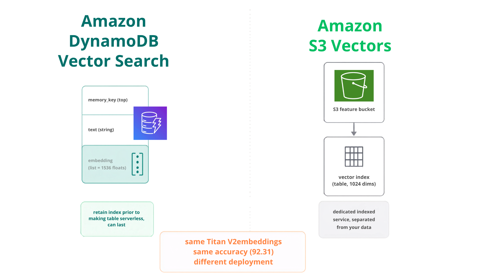

# AI Agent Memory: Add Semantic Search Without a Vector Database

**Problem:** Key-value memory (Demo 01) is perfect when you know the key. But users ask by *meaning*: "what should I avoid eating on this trip?" The answer sits under `dietary_notes`, and the question names no key and shares no words with the stored note.

**Solution:** Semantic search: embed each memory once at write time, embed the question at query time, retrieve by cosine similarity. You prototype the idea locally with [FAISS](https://github.com/facebookresearch/faiss) (an in-process library, zero infrastructure), then move to a managed store for anything that has to survive a restart or scale. On AWS that store is **Amazon S3 Vectors** or **Amazon DynamoDB Vector Search**, and this demo runs the same memories through all three so you can see the accuracy is identical and the choice is about where the vectors live.

This demo uses [Strands Agents](https://github.com/strands-agents/sdk-python), [FAISS](https://github.com/facebookresearch/faiss), [Amazon S3 Vectors](https://docs.aws.amazon.com/AmazonS3/latest/userguide/s3-vectors.html?trk=87c4c426-cddf-4799-a299-273337552ad8&sc_channel=el), and [Amazon Titan Text Embeddings V2](https://docs.aws.amazon.com/bedrock/latest/userguide/titan-embedding-models.html?trk=87c4c426-cddf-4799-a299-273337552ad8&sc_channel=el).

---

## What This Demo Shows

### The measured result

| Store | Category | Finds the answer | Similarity score | Survives restart |
|-------|----------|:----------------:|:----------------:|:----------------:|
| Key-value (keyword scan) | baseline | **No** (no shared words) | n/a | n/a |
| FAISS | in-process library (prototype) | **Yes** | **0.231** | No |
| S3 Vectors | managed AWS storage | **Yes** | **0.231** | Yes |
| DynamoDB Vector Search | managed, in your table | **Yes** | **0.231** | Yes |

All three vector backends return the same answer with the same similarity score: **accuracy is identical**, because they all use the same Titan V2 embeddings. So the backend is not an accuracy decision, it is about whether the memory has to persist and how you want to operate it. FAISS is the fastest way to prototype the idea in-process; S3 Vectors and DynamoDB Vector Search are the managed options that survive restarts and scale.




### When to use which

FAISS and the managed stores are not competing on the same axis: FAISS is an in-process library for prototyping, and S3 Vectors / DynamoDB Vector Search are managed services for anything that must persist. Pick by stage and operational fit, not by a query-latency race (they all return the same answer, and the Titan V2 embedding call dominates end-to-end time regardless).

| | FAISS | Amazon S3 Vectors | Amazon DynamoDB Vector Search | Dedicated vector database |
|---|---|---|---|---|
| **Type** | In-process library | Managed AWS storage | Vector index in your DynamoDB table | Full database engine |
| **Best for** | Prototype / local experiment | Standalone vector store at scale, infrequent access ([docs](https://docs.aws.amazon.com/AmazonS3/latest/userguide/s3-vectors.html?trk=87c4c426-cddf-4799-a299-273337552ad8&sc_channel=el)) | Real-time retrieval collocated with operational data ([docs](https://docs.aws.amazon.com/amazondynamodb/latest/developerguide/VectorSearch.html?trk=87c4c426-cddf-4799-a299-273337552ad8&sc_channel=el)) | High QPS, hybrid search, advanced filtering |
| **Infrastructure** | None (pip install) | None (fully managed) | None (your existing table) | Self-hosted or managed |
| **Survives restart** | No | Yes | Yes | Yes |
| **Semantic accuracy** | same | same | same | same |
| **Examples** | n/a | n/a | n/a | OpenSearch, Qdrant, Weaviate, Milvus, pgvector, Chroma |

### The decision table

| You need | Pick | Why |
|----------|------|-----|
| Facts under known keys (profile, prefs) | Key-value ([Demo 01](../01-key-value-memory-demo/)) | Exact and instant. Don't pay embeddings for lookups |
| Semantic search, local / prototype | **FAISS** | Zero infrastructure, pip install, in-process |
| Semantic search, cloud / infrequent queries | **S3 Vectors** | Purpose-built AWS vector storage, subsecond latency, up to 2B vectors |
| Agent data already in DynamoDB | **DynamoDB Vector Search** | Add a vector index to the existing table; single-digit ms query latency |
| High QPS, hybrid search, or advanced filtering | **Dedicated vector DB** | OpenSearch, Qdrant, Weaviate, Milvus, pgvector, Chroma |
| Multi-hop questions over relationships | Graph ([Demo 03](../03-graph-memory-demo/)) | Similarity can't follow edges |


---

## Scenarios Demonstrated

| Test | What it measures |
|------|------------------|
| **1. The key-value limit** | Keyword scan misses the semantic question; dump-all pays for the whole memory per question |
| **2. FAISS** | Same memories retrieved by meaning; query latency measured after warm-up |
| **3. S3 Vectors** | Same again, plus a fresh client (the "restart") still sees every vector |
| **4. DynamoDB Vector Search** | Same accuracy, single-digit ms latency; vector index lives inside a DynamoDB table alongside your operational data |
| **Notebook** | Both recall tools attached to one agent; it picks key-lookup vs semantic per question from the tool docstrings alone |

---

## Quick Start

### Prerequisites

- Python 3.10+
- **AWS credentials** (`aws configure`) power both Titan embeddings (Bedrock) and S3 Vectors. **The demo creates the vector bucket and index automatically if they don't exist.**
- **`OPENAI_API_KEY`** is only for the agent conversation (Test 4 / notebook); the retrieval measurements need no LLM. Or swap the agent model to Amazon Bedrock via the commented block.

```bash
cp .env.example .env   # set OPENAI_API_KEY; optionally VECTOR_BUCKET / VECTOR_INDEX / AWS_PROFILE
```

### Installation

```bash
uv venv && uv pip install -r requirements.txt
```

### Run Demo

```bash
uv run python test_vector_memory.py

# Interactive notebook
# Open test_vector_memory.ipynb in Jupyter, JupyterLab, or VS Code
```

---

## Files

| File | Purpose |
|------|---------|
| `test_vector_memory.py` | Main demo: 4 measured tests + comparison table (no LLM needed) |
| `test_vector_memory.ipynb` | Interactive walkthrough + a real agent choosing between the tools |
| `memory_stores.py` | The four stores + Titan embedder + self-provisioning (`ensure` pattern) |
| `tools.py` | Strands tools: `remember_note`, `recall_by_key`, `recall_semantic` |
| `requirements.txt` | Dependencies |

---

## How It Works

### One embedder, two backends

```python
def embed(text):                       # Amazon Titan V2, 1024 dims, used by BOTH backends
    ...

faiss_store.put(note, embed(note))     # index in RAM
s3v.put(key, note, embed(note))        # index in a vector bucket
```

### S3 Vectors, self-provisioned

```python
client.create_vector_bucket(vectorBucketName=bucket)             # if missing
client.create_index(vectorBucketName=bucket, indexName=index,
                    dimension=1024, distanceMetric="cosine",
                    dataType="float32")                          # if missing
client.put_vectors(..., vectors=[{"key": k, "data": {"float32": v},
                                  "metadata": {"text": note}}])
client.query_vectors(..., queryVector={"float32": qv}, topK=3,
                     returnDistance=True, returnMetadata=True)
```

### The agent picks the right tool by itself

`recall_by_key`'s docstring says "when the question maps to a known identifier"; `recall_semantic`'s says "when no key is obvious". In Test 4 the agent answers the food question with semantic search and the cabin question with a key lookup, no prompt engineering, just tool context.

---

## Key Concepts

### When semantic search earns its keep

For 10 memories, dump-all is still cheap (~650 chars). Semantic search pays off as memory **grows**: hundreds of notes means thousands of tokens per question with dump-all, while semantic top-3 stays constant. The retrieval cost that doesn't shrink: **embedding the question** (~0.5 s with Titan V2). Budget for it in latency-sensitive paths regardless of backend.

### Multi-tenant production note

For SaaS memory on S3 Vectors with per-tenant isolation (one index per tenant, IAM-scoped credentials), see the community plugin [`strands-s3-vectors-memory`](https://github.com/aws-samples/data-for-saas-patterns/tree/main/samples/multi-tenant-strands-s3-vectors-memory). It implements a different pattern (conversation summaries injected into the system prompt) on the same storage.

---

## Learning Objectives

1. Recognize the key-vs-meaning dividing line between key-value memory and vector-backed semantic search
2. Build an in-process vector index (FAISS) over agent memories with real embeddings
3. Use Amazon S3 Vectors end-to-end: create bucket/index, `put_vectors`, `query_vectors`
4. Measure what matters: semantic search retrieves the answer keyword scan misses, then compare the two vector backends by query latency and the embedding cost both share
5. Write recall tools whose docstrings let the agent choose the right one per question

---

## Troubleshooting

| Issue | Solution |
|-------|----------|
| `AccessDeniedException` on Bedrock | Enable model access for Titan Text Embeddings V2 in your region |
| `NotFoundException` from s3vectors | The demo creates bucket/index on first run; check the AWS credentials/region |
| Wrong AWS account picked up | `AWS_BEARER_TOKEN*` env vars override profiles; the demo drops them, scripts outside it may not |
| FAISS import error | `uv pip install faiss-cpu` (the wheel ships prebuilt) |
| Slow first query | First call pays connection/setup cost; the demo warms up before measuring |

**Tested versions:** Strands 1.46.0, faiss-cpu 1.14.3, boto3 1.43.72+, Titan Text Embeddings V2 (1024 dims).

---

## References

- [Amazon S3 Vectors: User Guide](https://docs.aws.amazon.com/AmazonS3/latest/userguide/s3-vectors.html?trk=87c4c426-cddf-4799-a299-273337552ad8&sc_channel=el)
- [Amazon Titan Text Embeddings V2](https://docs.aws.amazon.com/bedrock/latest/userguide/titan-embedding-models.html?trk=87c4c426-cddf-4799-a299-273337552ad8&sc_channel=el)
- [FAISS](https://github.com/facebookresearch/faiss)
- [Zep: Temporal Knowledge Graph for Agent Memory](https://arxiv.org/abs/2501.13956) (Rasmussen et al., 2025)
- [HippoRAG 2: From RAG to Memory](https://arxiv.org/abs/2502.14802) (Jimenez Gutierrez et al., 2025)
- [Strands Agents SDK](https://github.com/strands-agents/sdk-python)

---

## Pricing

This demo compares vector backends, so the cost depends on which one you run. FAISS is in-process and free; the managed backends and the embeddings are billed. Check the current rates:

| Service | Used for | Pricing |
|---------|----------|---------|
| Amazon S3 Vectors | Managed vector store (survives restart) | [S3 pricing](https://aws.amazon.com/s3/pricing/?trk=87c4c426-cddf-4799-a299-273337552ad8&sc_channel=el) |
| Amazon DynamoDB | Vector index inside your operational table | [DynamoDB pricing](https://aws.amazon.com/dynamodb/pricing/?trk=87c4c426-cddf-4799-a299-273337552ad8&sc_channel=el) |
| Amazon Bedrock (Titan Embeddings V2) | Embedding the memories and the query | [Bedrock pricing](https://aws.amazon.com/bedrock/pricing/?trk=87c4c426-cddf-4799-a299-273337552ad8&sc_channel=el) |
| OpenAI | Default chat model provider | [OpenAI pricing](https://openai.com/api/pricing/) |

FAISS (in-process) has no service cost. For an estimate before you commit spend, use the [AWS Pricing Calculator](https://calculator.aws/?trk=87c4c426-cddf-4799-a299-273337552ad8&sc_channel=el).

---

## Next Steps

1. [Demo 01: Key-Value Memory](../01-key-value-memory-demo/): the store this demo extends
2. [Demo 03: Graph Memory](../03-graph-memory-demo/): when similarity isn't enough (relationships)

---

## Contributing

Contributions are welcome! See [CONTRIBUTING](../CONTRIBUTING.md) for more information.

---

## Security

If you discover a potential security issue in this project, notify AWS/Amazon Security via the [vulnerability reporting page](https://aws.amazon.com/security/vulnerability-reporting/?trk=87c4c426-cddf-4799-a299-273337552ad8&sc_channel=el). Please do **not** create a public GitHub issue.

---

## License

This library is licensed under the MIT-0 License. See the [LICENSE](../LICENSE) file for details.
