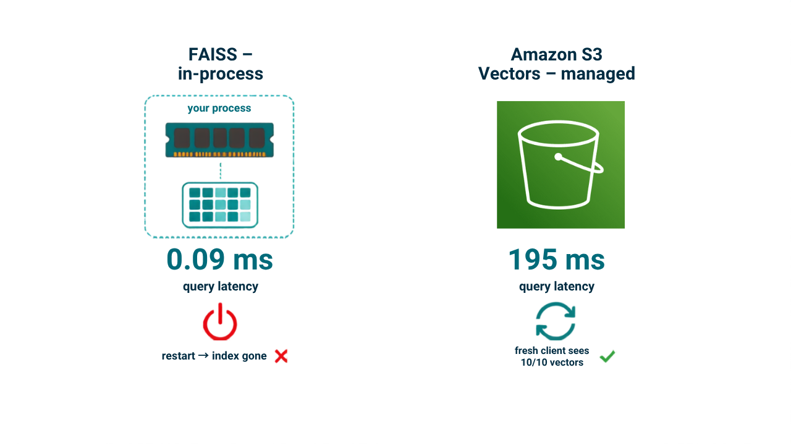
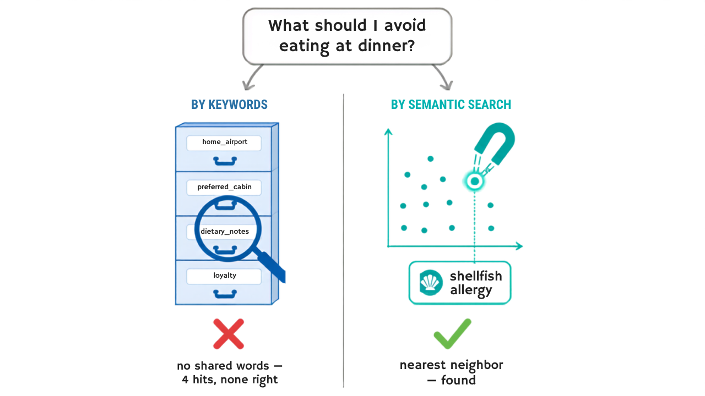

# AI Agent Memory: Add Semantic Search Without a Vector Database

**Problem:** Key-value memory (Demo 01) is perfect when you know the key. But users ask by *meaning*: "what should I avoid eating on this trip?" — the answer sits under `dietary_notes`, and the question names no key and shares no words with the stored note.

**Solution:** Semantic search — embed each memory once at write time, embed the question at query time, retrieve by cosine similarity. Then the real decision: **in-process index (FAISS) or managed vector storage (Amazon S3 Vectors)?** This demo measures both with the same embeddings and the same memories, so the only variable is the backend.

This demo uses [Strands Agents](https://github.com/strands-agents/sdk-python), [FAISS](https://github.com/facebookresearch/faiss), [Amazon S3 Vectors](https://docs.aws.amazon.com/AmazonS3/latest/userguide/s3-vectors.html?trk=87c4c426-cddf-4799-a299-273337552ad8&sc_channel=el), and [Amazon Titan Text Embeddings V2](https://docs.aws.amazon.com/bedrock/latest/userguide/titan-embedding-models.html?trk=87c4c426-cddf-4799-a299-273337552ad8&sc_channel=el). The patterns are framework-agnostic and carry over to other agent frameworks.

---

## What This Demo Shows

### The measured result

| Store | Finds the answer | Similarity score | Query latency |
|-------|:----------------:|:----------------:|:-------------:|
| Key-value (keyword scan) | **No** — no shared words | — | — |
| FAISS (in-process) | **Yes** | **0.231** | **<0.1 ms** |
| S3 Vectors (managed storage) | **Yes** | **0.231** | **~195 ms** |

FAISS and S3 Vectors return the same answer with the same score — accuracy is identical. The embedding call (~510 ms with Titan V2) dominates end-to-end latency for both.



### Vector store comparison

| | FAISS | Amazon S3 Vectors | Dedicated vector database |
|---|---|---|---|
| **Type** | In-process library | AWS vector storage | Full database engine |
| **Examples** | — | — | OpenSearch, Qdrant, Weaviate, Milvus, pgvector, Chroma |
| **Semantic accuracy** | ✅ same | ✅ same | ✅ same |
| **Infrastructure** | None — pip install | None — fully managed | Self-hosted or managed |
| **Max vectors** | RAM-bound | Up to 2 billion per index | Depends on deployment |
| **Query latency** | ~0.09 ms | ~195 ms | Sub-10 ms at high QPS |
| **Embedding cost** | +~510 ms | +~510 ms | +~510 ms |
| **Hybrid search** | ❌ | ❌ | ✅ most support it |
| **Best for** | Prototype / local agent | Cloud agent, infrequent queries | High QPS, advanced filtering, production search |

### The decision table

| You need | Pick | Why |
|----------|------|-----|
| Facts under known keys (profile, prefs) | Key-value ([Demo 01](../01-key-value-memory-demo/)) | Exact and instant — don't pay embeddings for lookups |
| Semantic search, local / prototype | **FAISS** | Zero infrastructure, pip install, in-process |
| Semantic search, cloud / infrequent queries | **S3 Vectors** | Purpose-built AWS vector storage, subsecond latency, up to 2B vectors |
| High QPS, hybrid search, or advanced filtering | **Dedicated vector DB** | OpenSearch, Qdrant, Weaviate, Milvus, pgvector, Chroma |
| Multi-hop questions over relationships | Graph ([Demo 03](../03-graph-memory-demo/)) | Similarity can't follow edges |



---

## Scenarios Demonstrated

| Test | What it measures |
|------|------------------|
| **1. The key-value limit** | Keyword scan misses the semantic question; dump-all pays for the whole memory per question |
| **2. FAISS** | Same memories retrieved by meaning; query latency measured after warm-up |
| **3. S3 Vectors** | Same again — plus a fresh client (the "restart") still sees every vector |
| **4. DynamoDB Vector Search** | Same accuracy, single-digit ms latency — vector index lives inside a DynamoDB table alongside your operational data |
| **Notebook** | Both recall tools attached to one agent; it picks key-lookup vs semantic per question from the tool docstrings alone |

---

## Quick Start

### Prerequisites

- Python 3.10+
- **AWS credentials** (`aws configure`) — power both Titan embeddings (Bedrock) and S3 Vectors. **The demo creates the vector bucket and index automatically if they don't exist.**
- **`OPENAI_API_KEY`** — only for the agent conversation (Test 4 / notebook); the retrieval measurements need no LLM. Or swap the agent model to Amazon Bedrock via the commented block.

```bash
cp .env.example .env   # set OPENAI_API_KEY; optionally VECTOR_BUCKET / VECTOR_INDEX / AWS_PROFILE
```

### Installation

```bash
uv venv && uv pip install -r requirements.txt
```

### Run Demo

```bash
uv run python test_vector_memory.py

# Interactive notebook
# Open test_vector_memory.ipynb in Jupyter, JupyterLab, or VS Code
```

---

## Files

| File | Purpose |
|------|---------|
| `test_vector_memory.py` | Main demo — 4 measured tests + comparison table (no LLM needed) |
| `test_vector_memory.ipynb` | Interactive walkthrough + a real agent choosing between the tools |
| `memory_stores.py` | The four stores + Titan embedder + self-provisioning (`ensure` pattern) |
| `tools.py` | Strands tools: `remember_note`, `recall_by_key`, `recall_semantic` |
| `requirements.txt` | Dependencies |

---

## How It Works

### One embedder, two backends

```python
def embed(text):                       # Amazon Titan V2, 1024 dims — used by BOTH backends
    ...

faiss_store.put(note, embed(note))     # index in RAM
s3v.put(key, note, embed(note))        # index in a vector bucket
```

### S3 Vectors, self-provisioned

```python
client.create_vector_bucket(vectorBucketName=bucket)             # if missing
client.create_index(vectorBucketName=bucket, indexName=index,
                    dimension=1024, distanceMetric="cosine",
                    dataType="float32")                          # if missing
client.put_vectors(..., vectors=[{"key": k, "data": {"float32": v},
                                  "metadata": {"text": note}}])
client.query_vectors(..., queryVector={"float32": qv}, topK=3,
                     returnDistance=True, returnMetadata=True)
```

### The agent picks the right tool by itself

`recall_by_key`'s docstring says "when the question maps to a known identifier"; `recall_semantic`'s says "when no key is obvious". In Test 4 the agent answers the food question with semantic search and the cabin question with a key lookup — no prompt engineering, just tool context.

---

## Key Concepts

### When semantic search earns its keep

For 10 memories, dump-all is still cheap (~650 chars). Semantic search pays off as memory **grows**: hundreds of notes means thousands of tokens per question with dump-all, while semantic top-3 stays constant. The retrieval cost that doesn't shrink: **embedding the question** (~0.5 s with Titan V2) — budget for it in latency-sensitive paths regardless of backend.

### Multi-tenant production note

For SaaS memory on S3 Vectors with per-tenant isolation (one index per tenant, IAM-scoped credentials), see the community plugin [`strands-s3-vectors-memory`](https://github.com/aws-samples/data-for-saas-patterns/tree/main/samples/multi-tenant-strands-s3-vectors-memory) — it implements a different pattern (conversation summaries injected into the system prompt) on the same storage.

---

## Learning Objectives

1. Recognize the key-vs-meaning dividing line between key-value memory and vector-backed semantic search
2. Build an in-process vector index (FAISS) over agent memories with real embeddings
3. Use Amazon S3 Vectors end-to-end: create bucket/index, `put_vectors`, `query_vectors`
4. Measure what matters: semantic search retrieves the answer keyword scan misses — then compare the two vector backends by query latency and the embedding cost both share
5. Write recall tools whose docstrings let the agent choose the right one per question

---

## Troubleshooting

| Issue | Solution |
|-------|----------|
| `AccessDeniedException` on Bedrock | Enable model access for Titan Text Embeddings V2 in your region |
| `NotFoundException` from s3vectors | The demo creates bucket/index on first run — check the AWS credentials/region |
| Wrong AWS account picked up | `AWS_BEARER_TOKEN*` env vars override profiles; the demo drops them, scripts outside it may not |
| FAISS import error | `uv pip install faiss-cpu` (the wheel ships prebuilt) |
| Slow first query | First call pays connection/setup cost — the demo warms up before measuring |

**Tested versions:** Strands 1.46.0, faiss-cpu 1.14.3, boto3 1.43.72+, Titan Text Embeddings V2 (1024 dims).

---

## References

- [Amazon S3 Vectors — User Guide](https://docs.aws.amazon.com/AmazonS3/latest/userguide/s3-vectors.html?trk=87c4c426-cddf-4799-a299-273337552ad8&sc_channel=el)
- [Amazon Titan Text Embeddings V2](https://docs.aws.amazon.com/bedrock/latest/userguide/titan-embedding-models.html?trk=87c4c426-cddf-4799-a299-273337552ad8&sc_channel=el)
- [FAISS](https://github.com/facebookresearch/faiss)
- [Zep: Temporal Knowledge Graph for Agent Memory](https://arxiv.org/abs/2501.13956) — Rasmussen et al., 2025
- [HippoRAG 2: From RAG to Memory](https://arxiv.org/abs/2502.14802) — Jimenez Gutierrez et al., 2025
- [Strands Agents SDK](https://github.com/strands-agents/sdk-python)

---

## Next Steps

1. [Demo 01: Key-Value Memory](../01-key-value-memory-demo/) — the store this demo extends
2. [Demo 03: Graph Memory](../03-graph-memory-demo/) — when similarity isn't enough: relationships

---

## Contributing

Contributions are welcome! See [CONTRIBUTING](../CONTRIBUTING.md) for more information.

---

## Security

If you discover a potential security issue in this project, notify AWS/Amazon Security via the [vulnerability reporting page](https://aws.amazon.com/security/vulnerability-reporting/?trk=87c4c426-cddf-4799-a299-273337552ad8&sc_channel=el). Please do **not** create a public GitHub issue.

---

## License

This library is licensed under the MIT-0 License. See the [LICENSE](../LICENSE) file for details.
