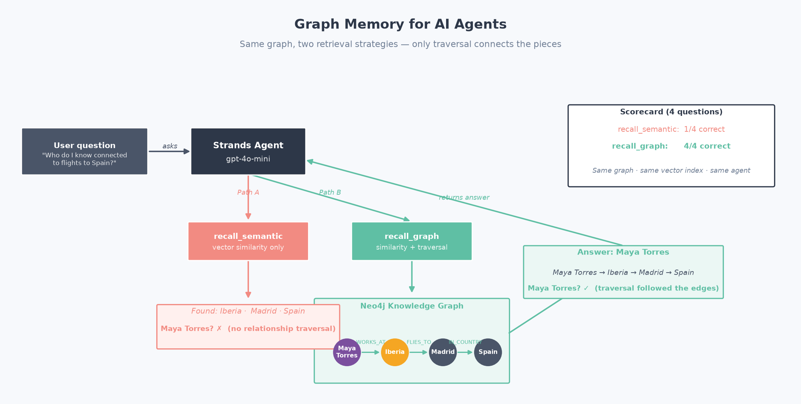
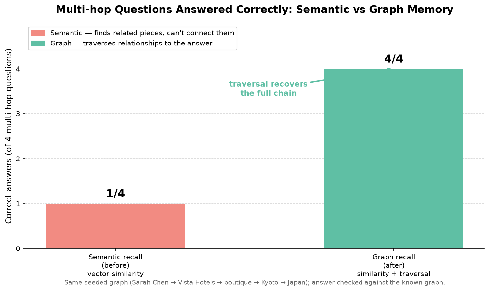
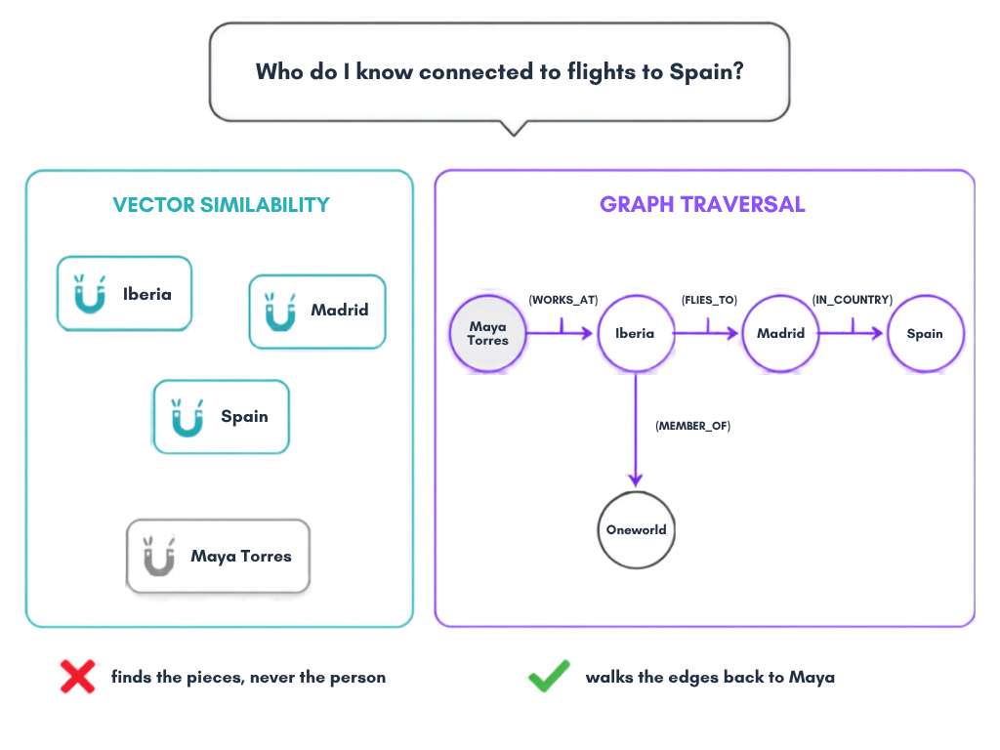

# Graph Memory for AI Agents: Reasoning Over Relationships, Not Just Similarity

**Problem:** Semantic memory retrieves by *similarity*, so it finds related pieces but can't connect them. A multi-hop question ("Who do I know that's connected to flights to Spain?") needs the *relationships* between memories, not just their vectors.

**Solution:** Store memories as a knowledge graph, built by an LLM against a pinned schema. Find an entry point by vector similarity, then **traverse the graph** to the answer.

> **Assumed familiarity:** This demo builds on [Demo 01](../01-key-value-memory-demo/) (agent state) and [Demo 02](../02-vector-memory-demo/) (semantic retrieval). It also requires a running Neo4j instance.

Based on research:
- [GAAMA: Graph Augmented Associative Memory for Agents](https://arxiv.org/abs/2603.27910), Paul et al., 2026
- [MAGMA: A Multi-Graph based Agentic Memory Architecture for AI Agents](https://arxiv.org/abs/2601.03236), Jiang et al., 2026
- [GRAVITY: Architecture-Agnostic Structured Anchoring for Long-Horizon Conversational Memory](https://arxiv.org/abs/2605.01688), Sun et al., 2026

This demo uses [Strands Agents](https://github.com/strands-agents/sdk-python) for the agent harness and [Neo4j](https://neo4j.com/) with [`neo4j-graphrag`](https://neo4j.com/docs/neo4j-graphrag-python/) for graph memory. The graph is built by `SimpleKGPipeline`: an LLM reads text and extracts typed entities and relationships against a pinned schema, then merges duplicates. No hand-written `MERGE` statements, no regex triple extractor.

> **Official integration.** This demo wires the two `neo4j-graphrag` retrievers by hand on purpose, to expose the retrieval mechanics (the `VectorRetriever` vs `VectorCypherRetriever` contrast is the whole point). For production, Neo4j Labs ships an official Strands integration, [`neo4j-agent-memory`](https://neo4j.com/labs/agent-memory/how-to/integrations/aws-strands/), that provides a `Neo4jSessionManager` you attach with `Agent(session_manager=...)` to auto-persist turns and inject graph memories. It is a Neo4j Labs package (community-supported), not part of the Strands SDK core, and it hides the low-level retrieval this demo teaches.



---

## What This Demo Shows

### The scenario: what the agent learned across sessions

Over several conversations, a travel assistant picked up plain-text facts about several people, airlines, and destinations. An LLM extracts them into a graph where, for one traveler, they form a chain:

```
(Maya Torres) ──WORKS_AT──▶ (Iberia) ──MEMBER_OF──▶ (Oneworld)
                                  │
                             FLIES_TO
                                  ▼
                              (Madrid) ──IN_COUNTRY──▶ (Spain)
```

Other people (Diego Fuentes / Lufthansa / Munich, Priya Nair / Qatar Airways / Doha, Sofia Rossi / ITA Airways / Rome) form parallel chains, so the multi-hop question has one right answer among similar-looking distractors.

**The question:** *"Who do I know that's connected to flights to Spain?"*

The answer, **Maya Torres**, is never stated directly. You can only reach it by following the relationships. That's a multi-hop question, and it's exactly where similarity-only memory falls short.



### Semantic recall vs graph recall: same graph, same agent harness

| Retriever strategy | How it works | Result on the multi-hop question |
|--------------------|-------------|----------------------------------|
| **Semantic recall** (`recall_semantic`) | `VectorRetriever`: similarity over chunks | Returns the matching text fragments (`Madrid is in Spain.`, `Maya Torres works at Iberia.`). **Never connects them to a person.** |
| **Graph recall** (`recall_graph`) | `VectorCypherRetriever`: similarity → Cypher traversal | Matches an entry chunk, walks into the entities extracted from it, and returns the person plus the chain: **Maya Torres → Iberia → Madrid → Spain.** |

Both strategies receive the **same text** and share the **same chunk vector index**. The graph wins because the LLM extracted *connected entities* from the text, not because it's handed the answer. The advantage is structural.



---

## Scenarios Demonstrated

| Test | What it does | Recovers the multi-hop answer? |
|------|--------------|-------------------------------|
| **1. Agent: semantic recall only** | Agent with `recall_semantic`: similarity over chunks, no traversal | No |
| **2. Agent: graph recall** | Agent with `recall_graph`: similarity + graph traversal | Yes |
| **3. Full travel agent** | Agent with all 6 tools: searches flights, books, recalls, and grows the graph via `remember_fact` | Yes |
| **4. Deterministic scorecard** | 4 multi-hop questions, semantic vs graph, checked against the known graph | semantic **1/4**, graph **4/4** |

The scorecard is a deterministic check against the known graph (**not** an LLM judge), so the numbers are reproducible.

---

## The Strands angle (the harness)

Plugging an external graph store into a full travel agent is *just tools + state* with Strands. Six tools split into two groups:

```python
agent = Agent(
    model=MODEL,
    system_prompt="You are a personal travel assistant. Be concise: at most 3 sentences.",
    tools=[
        # Travel tools: what the assistant does
        search_flights, book_flight, best_time_to_visit,
        # Memory tools: how the assistant remembers
        recall_graph, recall_semantic, remember_fact,
    ],
)
```

`remember_fact` is the write path: it passes one plain-English sentence to the same `SimpleKGPipeline`, so a new fact is extracted into graph nodes and edges the same way the graph was first built, then answerable by traversal.

`recall_graph` and `recall_semantic` are thin wrappers over the two `neo4j-graphrag` retriever classes (`VectorCypherRetriever` and `VectorRetriever`), so no custom retrieval code is needed. The system prompt is role-only; each tool's purpose lives in its docstring.

---

## Quick Start

### Prerequisites

```bash
python --version   # Python 3.9+
export OPENAI_API_KEY="your-key-here"
```

You also need a running **Neo4j** (5.18.1+ or Aura). Options:

- **Neo4j Desktop**: create a local instance and start it (default bolt port `7687`).
- **Docker**: `docker run -p 7474:7474 -p 7687:7687 -e NEO4J_AUTH=neo4j/your-password neo4j:latest`
- **Neo4j Aura**: free tier; use the `neo4j+s://...` URI it gives you.

**AI Model Provider:** This demo uses OpenAI by default. You can also use [Amazon Bedrock](https://aws.amazon.com/bedrock/?trk=87c4c426-cddf-4799-a299-273337552ad8&sc_channel=el), Anthropic, or Ollama. See [supported model providers](https://strandsagents.com/docs/user-guide/concepts/model-providers/?trk=87c4c426-cddf-4799-a299-273337552ad8&sc_channel=el).

### Installation

```bash
uv venv && uv pip install -r requirements.txt
cp .env.example .env   # fill in OPENAI_API_KEY and NEO4J_* values
```

### Deterministic vs model-based

The control lives in the agent's harness: retrievers and the extraction pipeline are tools the agent calls. Building the graph with `SimpleKGPipeline` and the embeddings are model inference; the cosine similarity and the Cypher traversal are deterministic. Pinning the schema and extracting at `temperature=0` make construction reproducible enough for the scorecard, but a model call carries no such guarantee ([research](https://arxiv.org/abs/2601.17768)). Once the graph exists, the 1/4 vs 4/4 contrast is deterministic.

## Run Demo

```bash
uv run python test_graph_memory.py

# Interactive chat (graph recall, or semantic-only for contrast)
uv run python chat_graph.py
uv run python chat_semantic.py

# Interactive notebook
# Open test_graph_memory.ipynb in Jupyter, JupyterLab, or VS Code
```

---

## Files

| File | Purpose |
|------|---------|
| `test_graph_memory.py` | Main demo: 4 agent tests + scorecard comparison table |
| `test_graph_memory.ipynb` | Interactive notebook walkthrough |
| `graph_memory.py` | Graph memory layer: Neo4j connection, isolated `memorydemo` database, `SimpleKGPipeline` (LLM extraction) against the pinned schema, chunk vector index, `make_semantic_retriever`, `make_graph_retriever` |
| `travel_tools.py` | Strands `@tool`s. **Travel:** `search_flights`, `book_flight`, `best_time_to_visit` · **Memory:** `remember_fact` (feeds the extraction pipeline), `recall_semantic`, `recall_graph` |
| `chat_graph.py` | Interactive CLI with graph recall (`recall_graph` + all tools) |
| `chat_semantic.py` | Interactive CLI with semantic recall only (`recall_semantic`) |
| `flights_api.py` | Duffel sandbox flight search with offline fallback |
| `weather_api.py` | Open-Meteo historical climate data |
| `fallback_offers.json` | Captured real offers for offline resilience |
| `images/generate_chart.py` | Generates the scorecard chart |
| `requirements.txt` | Dependencies |

---

## How It Works

### 1. Let an LLM build the graph from text

The memories are plain sentences (`"Maya Torres works at Iberia."`, `"Madrid is in Spain."`). `SimpleKGPipeline` reads them, an LLM extracts typed entities and relationships against a pinned schema, and duplicate entities are merged (one `Iberia`, not one per mention). The pipeline writes a lexical graph (`Document → Chunk → extracted entities`) and embeds each `Chunk` with OpenAI `text-embedding-3-small`. No hand-written `MERGE`, no regex.

```python
GRAPH_SCHEMA = {
    "node_types": [{"label": "Person", ...}, {"label": "Airline", ...},
                   {"label": "Alliance", ...}, {"label": "City", ...}, {"label": "Country", ...}],
    "relationship_types": [{"label": "WORKS_AT"}, {"label": "MEMBER_OF"},
                           {"label": "FLIES_TO"}, {"label": "IN_COUNTRY"}],
    "patterns": [("Person", "WORKS_AT", "Airline"), ("Airline", "MEMBER_OF", "Alliance"),
                 ("Airline", "FLIES_TO", "City"), ("City", "IN_COUNTRY", "Country")],
    "additional_node_types": False,        # refuse anything outside the contract,
    "additional_relationship_types": False,  # so the traversal below can rely on the labels
    "additional_patterns": False,
}
```

### 2. Create a native Neo4j vector index over the chunks

`SimpleKGPipeline` embeds the `Chunk` nodes but does not create the index, so the demo creates it explicitly over `Chunk.embedding`:

```python
from neo4j_graphrag.indexes import create_vector_index
create_vector_index(driver, "chunk_embeddings", label="Chunk",
                    embedding_property="embedding", dimensions=1536,
                    similarity_fn="cosine", neo4j_database=db)
```

### 3. Two retrieval strategies, wrapped as Strands tools

```python
from neo4j_graphrag.retrievers import VectorRetriever, VectorCypherRetriever

# recall_semantic: similarity over chunks, returns the matching text fragments only
semantic_retriever = VectorRetriever(driver, "chunk_embeddings", embedder=embedder,
                                     return_properties=["text"], neo4j_database=db)

# recall_graph: similarity → traversal. From the matched Chunk, step into the entities
# extracted from it (FROM_CHUNK), find a Person, and return the shortest path.
RETRIEVAL_QUERY = """
WITH node AS chunk, score
MATCH (chunk)<-[:FROM_CHUNK]-(entity)
MATCH (person:Person) WHERE person <> entity
MATCH path = shortestPath((person)-[:WORKS_AT|MEMBER_OF|FLIES_TO|IN_COUNTRY*1..5]-(entity))
RETURN DISTINCT person.name AS who,
       [n IN nodes(path) | coalesce(n.name, head(labels(n)))] AS chain,
       max(score) AS score
ORDER BY score DESC
LIMIT 5
"""
graph_retriever = VectorCypherRetriever(driver, "chunk_embeddings", RETRIEVAL_QUERY,
                                        embedder=embedder, neo4j_database=db)
```

This "vector search then expand through the graph" is the documented graph-RAG pattern.

### 4. remember_fact grows the graph through the same pipeline

New facts are not written with hand-built Cypher. `remember_fact` passes the sentence to the same `SimpleKGPipeline`, so the LLM extracts it against the pinned schema and the chunk index is refreshed, exactly how the graph was first built:

```python
@tool
def remember_fact(sentence: str) -> str:
    pipeline = gm.build_pipeline(driver, db, embedder=embedder)
    _run_async(pipeline.run_async(text=sentence))   # LLM extraction, same schema
    create_vector_index(driver, gm.VECTOR_INDEX_NAME, label=gm.CHUNK_LABEL, ...)
    return f"Extracted and stored into the graph: {sentence!r}"
```

---

## Key Concepts

### Why multi-hop needs a graph

| Memory type | Stores | Answers "what do I know about X?" | Answers "who is connected to X through Y?" |
|-------------|--------|-----------------------------------|--------------------------------------------|
| Flat / key-value | Blobs | Yes (if you dump it) | No |
| Semantic (Demo 02) | Blobs + vectors | Yes (top-k) | No (no notion of relationships) |
| **Graph (this demo)** | Nodes + edges + vectors | Yes | **Yes (traverse the edges)** |

### This demo vs a production graph

| Component | Demo | Production |
|-----------|------|------------|
| Graph construction | LLM entity extraction (`SimpleKGPipeline`) from plain text, pinned schema | Same, over larger and messier corpora |
| Embeddings | OpenAI `text-embedding-3-small` (real), on the chunks | Same, or Amazon Titan via Bedrock |
| Index | Neo4j native vector index over `Chunk.embedding` | Same, plus fulltext / hybrid retrievers |
| Traversal | Fixed shortest-path Cypher in `VectorCypherRetriever` | Learned or templated multi-hop queries |

The demo already uses the production graph-construction pattern (`SimpleKGPipeline`). To keep the before/after scorecard stable, the extraction LLM runs at `temperature=0` and the schema is pinned with `additional_*: False`, so the same sentences yield the same graph run to run.

---

## Learning Objectives

1. Understand why similarity-only memory fails on multi-hop questions
2. Let an LLM model agent memory as a knowledge graph (typed nodes, edges, chunk embeddings) with `SimpleKGPipeline` and a pinned schema
3. Contrast `recall_semantic` vs `recall_graph` on the same text via agentic tests
4. Plug an external graph store into a full Strands travel agent with just tools + state
5. Have `remember_fact` grow the graph through the same extraction pipeline that built it

---

## Troubleshooting

| Issue | Solution |
|-------|----------|
| `ServiceUnavailable` / connection refused | Neo4j isn't running or `NEO4J_URI` is wrong. Start the instance; check the bolt port (`7687`). |
| `AuthError: unauthorized` | Wrong `NEO4J_USER` / `NEO4J_PASSWORD` in `.env`. |
| `Invalid input 'SEARCH'` (CypherSyntaxError) | Version churn (see below). The demo creates its database already in Cypher 25 on Neo4j 2026.01+. On Neo4j Community: set `db.query.default_language=CYPHER_25` in `neo4j.conf` and restart. |
| Can't create database `memorydemo` | Expected on Neo4j Community (single database). The demo falls back to the default database automatically. |
| `OPENAI_API_KEY` errors | Both the chat model and the embeddings need it. Set it in `.env`, or switch to the Bedrock/Titan block. |

### An API-churn note (why the `SEARCH` clause matters)

`neo4j-graphrag` 1.18.0 emits the newer `SEARCH ... IN (VECTOR INDEX ...)` Cypher clause on Neo4j **2026.01+**. That clause is only parsed under **Cypher 25**, but current Neo4j servers still default to **Cypher 5**. This demo handles it the supported way: it creates its database *already in Cypher 25*, atomically:

```cypher
CREATE DATABASE memorydemo IF NOT EXISTS DEFAULT LANGUAGE CYPHER 25
```

Gated on the library's own `supports_search_clause` (no `neo4j.conf` edit and no server restart needed). On Neo4j **5.x** the retrievers use the classic `db.index.vector.queryNodes` procedure and no language change is needed.

**Tested versions:** Strands 1.55.1, `neo4j-graphrag` 1.18.0, `neo4j` driver 6.2.0, Neo4j server 2026.x Enterprise.

---

## References

- [GAAMA: Graph Augmented Associative Memory for Agents](https://arxiv.org/abs/2603.27910), Paul et al., 2026
- [MAGMA: A Multi-Graph based Agentic Memory Architecture for AI Agents](https://arxiv.org/abs/2601.03236), Jiang et al., 2026
- [GRAVITY: Architecture-Agnostic Structured Anchoring for Long-Horizon Conversational Memory](https://arxiv.org/abs/2605.01688), Sun et al., 2026
- [Strands Agents SDK](https://github.com/strands-agents/sdk-python)
- [neo4j-graphrag (Python)](https://neo4j.com/docs/neo4j-graphrag-python/)
- [Neo4j vector indexes](https://neo4j.com/docs/cypher-manual/current/indexes/semantic-indexes/vector-indexes/)

We reproduce the *mechanism* these papers describe (graph-structured memory + relationship traversal), not their specific benchmark numbers.

---

## Pricing

This demo needs a Neo4j instance plus a model provider. Neo4j runs free locally (Desktop or Docker); the managed option (Aura) is billed. Check the current rates:

| Service | Used for | Pricing |
|---------|----------|---------|
| Neo4j Aura | Managed graph database (skip if you run Neo4j locally) | [Neo4j Aura pricing](https://neo4j.com/pricing/) |
| Amazon Bedrock (Titan Embeddings V2) | Optional: embeddings for vector entry points, and/or model provider | [Bedrock pricing](https://aws.amazon.com/bedrock/pricing/?trk=87c4c426-cddf-4799-a299-273337552ad8&sc_channel=el) |
| OpenAI | Default chat model provider | [OpenAI pricing](https://openai.com/api/pricing/) |

Running Neo4j locally has no service cost; only the model provider is billed. For an estimate of any AWS usage before you commit spend, use the [AWS Pricing Calculator](https://calculator.aws/?trk=87c4c426-cddf-4799-a299-273337552ad8&sc_channel=el).

---

## Next Steps

1. [Demo 02: Vector Memory](../02-vector-memory-demo/): similarity retrieval (what this demo extends)
2. [Demo 04: Selective Memory](../04-selective-memory-demo/): the agent decides what to remember

---

## Contributing

Contributions are welcome! See [CONTRIBUTING](../CONTRIBUTING.md) for more information.

---

## Security

If you discover a potential security issue in this project, notify AWS/Amazon Security via the [vulnerability reporting page](https://aws.amazon.com/security/vulnerability-reporting/). Please do **not** create a public GitHub issue.

---

## License

This library is licensed under the MIT-0 License. See the [LICENSE](../LICENSE) file for details.
