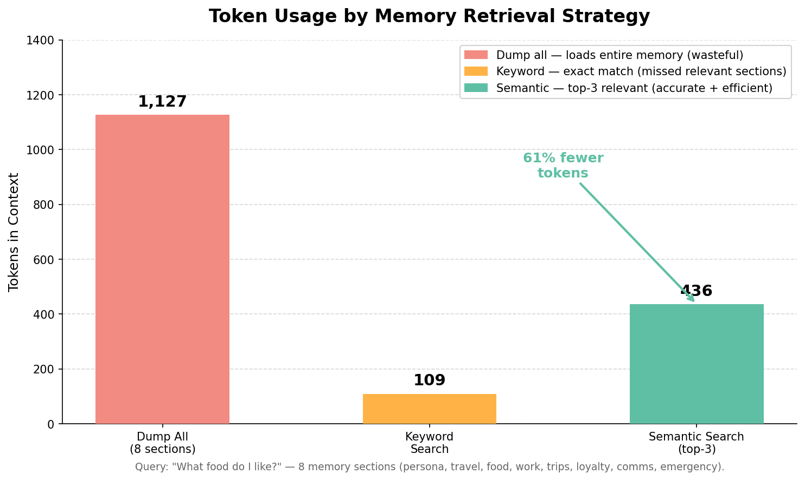

# Fix AI Agent Memory Retrieval: Semantic Search Over Core Memory

**Problem:** When core memory grows large, dumping everything into context is inefficient and degrades response quality.

**Solution:** Semantic search over memory sections — retrieve only the most relevant memories per query.

Based on research:
- [Zep: Temporal Knowledge Graph for Agent Memory](https://arxiv.org/abs/2501.13956) — Rasmussen et al., 2025
- [PersonaAgent with GraphRAG](https://arxiv.org/abs/2511.17467) — Liang et al., 2025
- [HippoRAG 2: From RAG to Memory](https://arxiv.org/abs/2502.14802) — Jimenez Gutierrez et al., 2025

This demo implements retrieval patterns using [Strands Agents SDK](https://github.com/strands-agents/sdk-python). The patterns are framework-agnostic and can be applied with LangGraph, AutoGen, or other agent frameworks.

---

## What This Demo Shows

### Real-World Scenario: Rich User Profile

A travel assistant has accumulated 8 memory sections about a user:

| Section | Content |
|---------|---------|
| `persona` | Name, role, location, languages |
| `travel_preferences` | Style, stars, amenities, budget |
| `food_preferences` | Dietary, allergies, favorites |
| `work_schedule` | Timezone, meetings, blackout dates |
| `past_trips` | 6 past trips with ratings and notes |
| `loyalty_programs` | Hotel/airline status and miles |
| `communication_style` | Tone, format, language |
| `emergency_contacts` | Primary, secondary, insurance |

**The question:** "What food do I like and what should I avoid?"

Only `food_preferences` and maybe `past_trips` are relevant. Why load all 8 sections?


---

## Scenarios Demonstrated

| Scenario | Strategy | Precision | Token cost |
|----------|----------|-----------|------------|
| **1. Dump all** | Load entire memory | Low — noise dilutes signal | High |
| **2. Keyword** | Exact string match | Medium — misses synonyms | Medium |
| **3. Semantic** | Embedding similarity, top-3 | High — finds related concepts | Low |
| **4. Multi-turn** | Semantic per query | High — different memories per turn | Low |



---

## Quick Start

### Prerequisites

```bash
python --version  # Python 3.9+
export OPENAI_API_KEY="your-key-here"
```

**AI Model Provider** — This demo uses OpenAI by default. You can also use [Amazon Bedrock](https://aws.amazon.com/bedrock/), Anthropic, or Ollama. See [supported model providers](https://strandsagents.com/docs/user-guide/concepts/model-providers/) for details. Change the model in the test script.

### Installation

```bash
uv venv && uv pip install -r requirements.txt
```

### Run Demo

```bash
uv run python test_memory_retrieval.py
```

---

## Files

| File | Purpose |
|------|---------|
| `test_memory_retrieval.py` | Main demo — 4 scenarios with comparison |
| `tools.py` | Three retrieval strategies + memory seed data |
| `requirements.txt` | Dependencies |

---

## How It Works

### Strategy 1: Dump All (baseline)

```python
@tool(context=True)
def memory_dump_all(tool_context: ToolContext) -> str:
    memory = tool_context.agent.state.get("core_memory") or {}
    return json.dumps(memory, indent=2)  # Everything enters context
```

### Strategy 2: Keyword Search

```python
@tool(context=True)
def memory_search_keyword(keyword: str, tool_context: ToolContext) -> str:
    for section, entry in memory.items():
        if keyword.lower() in json.dumps(entry).lower():
            matches.append(entry)
    return json.dumps(matches)  # Only matching sections
```

### Strategy 3: Semantic Search

Uses a real embedding model (OpenAI `text-embedding-3-small`). Section embeddings
are computed once at seed time and cached in `agent.state`; each query only embeds
the query itself — the same pattern a production vector store uses.

```python
@tool(context=True)
def memory_search_semantic(query: str, tool_context: ToolContext, top_k: int = 3) -> str:
    query_embedding = _embed_text(query)                 # real embedding call
    for section, entry in memory.items():
        section_embedding = entry["embedding"]           # cached from seed time
        similarity = _cosine_similarity(query_embedding, section_embedding)
        scored.append((section, similarity, entry))
    return top_k_results  # Only most relevant sections
```

Because it matches on **meaning**, a query like *"dietary restrictions and culinary
tastes"* retrieves the `food_preferences` section even though it shares no words with
it — where keyword search returns nothing.

---

## Key Concepts

### Why Retrieval Matters at Scale

| Memory sections | Dump all tokens | Semantic (top-3) tokens | Savings |
|----------------|-----------------|------------------------|---------|
| 8 | ~2,000 | ~800 | 60% |
| 50 | ~12,000 | ~800 | 93% |
| 200 | ~50,000 | ~800 | 98% |

As memory grows, dump-all becomes untenable. Semantic search stays constant.

### Production Upgrades

This demo already uses real embeddings. To take it further in production:

| Component | Demo | Production |
|-----------|------|------------|
| Embeddings | OpenAI `text-embedding-3-small` (real) | Same, or Amazon Titan / Sentence Transformers (Bedrock block in `tools.py`) |
| Index | Cached vectors + linear cosine scan | FAISS, pgvector, or a native vector index (see Demo 04 with Neo4j) |
| Temporal | None | Zep-style temporal weighting (recent memories score higher) |
| Graph | None | Knowledge-graph memory with traversal (see Demo 04) |

---

## Learning Objectives

1. Understand why memory retrieval becomes critical as agent memory grows
2. Compare dump-all, keyword, and semantic retrieval strategies
3. Measure token cost differences between strategies
4. Design agents that retrieve only relevant context per query
5. Connect to production patterns (FAISS, Zep, GraphRAG)

---

## Troubleshooting

| Issue | Solution |
|-------|---------|
| Semantic search returns wrong sections | Check that section embeddings were seeded (see `seed_memory`); embeddings are cached in `agent.state` |
| Keyword search misses results | Keywords must be exact matches — use semantic search for meaning-based matching |
| `OPENAI_API_KEY` errors on semantic search | Semantic search makes a real embedding call — set the key, or switch to the Bedrock/Titan block in `tools.py` |
| High token count on dump-all | Expected behavior — this is the baseline showing why retrieval matters |

---

## References

- [Zep: Temporal Knowledge Graph](https://arxiv.org/abs/2501.13956) — 94.8% on DMR, 90% less latency
- [PersonaAgent with GraphRAG](https://arxiv.org/abs/2511.17467) — +56.1% F1 on movie tagging
- [HippoRAG 2: From RAG to Memory](https://arxiv.org/abs/2502.14802) — +7% associative memory
- [Reflective Memory Management](https://arxiv.org/abs/2503.08026) — +10% accuracy on LongMemEval

### Framework Documentation

- [Strands Agent State](https://github.com/strands-agents/sdk-python#agent-state)

---

## Next Steps

1. [Demo 01: Memory Decay](../01-memory-decay-demo/) — Why agents forget (the problem)
2. [Demo 02: Core Memory](../02-core-memory-demo/) — Agent-managed structured memory (the solution)

---

## License

MIT-0 License
