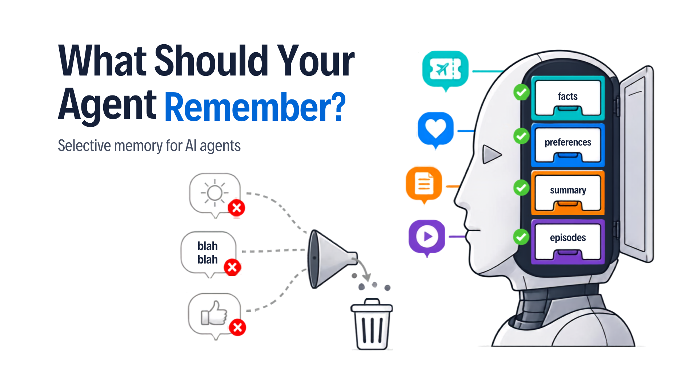
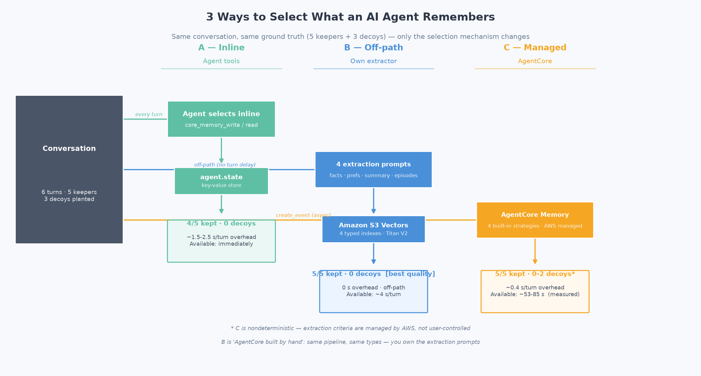
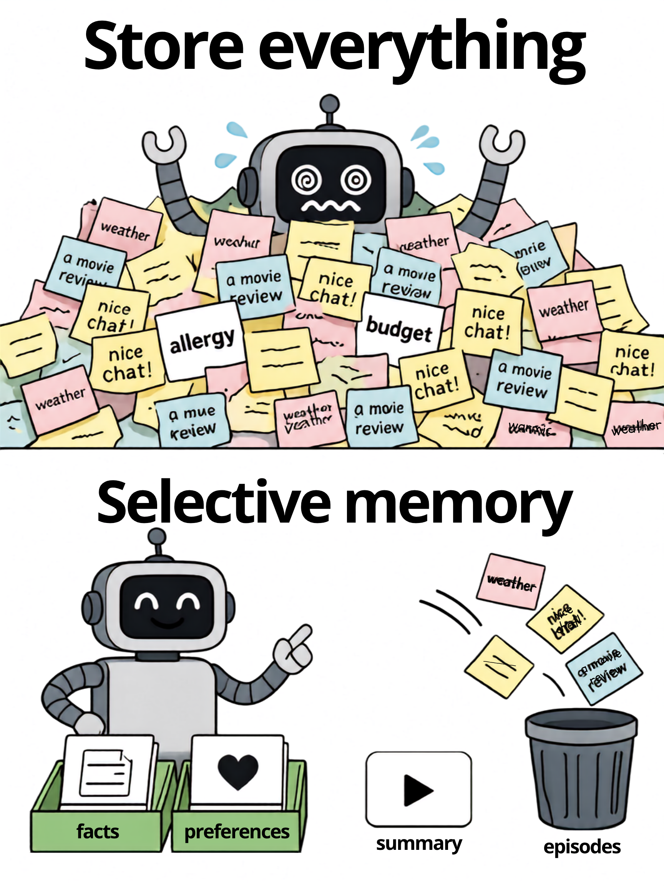
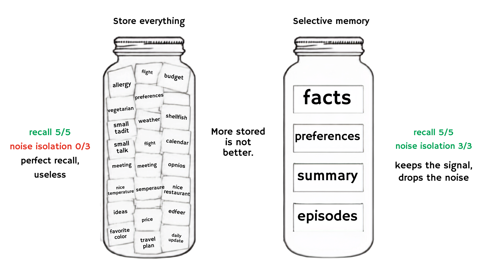

# What Should Your AI Agent Actually Remember? 3 Ways to Build Selective Memory



**Problem:** A real conversation mixes durable facts, throwaway small talk, preferences, and events. Store everything and memory becomes expensive and dirty ([Demo 05](../05-memory-hygiene-demo/) shows it's also dangerous); store nothing and the agent forgets its user (Demo 01, Test 1).

**Solution:** **Selection** means deciding what deserves to persist, in which memory *type*, and what to ignore. This demo builds it three ways and measures them against the same planted conversation with deterministic ground truth.

The first two mechanisms run entirely on **Strands Agents' native memory framework** with no hand-rolled memory tools, no memory logic in the chat agent's system prompt. The third is fully managed by AWS ([Amazon Bedrock AgentCore Memory](https://docs.aws.amazon.com/bedrock-agentcore/latest/devguide/built-in-strategies.html?trk=87c4c426-cddf-4799-a299-273337552ad8&sc_channel=el)). Storage is [Amazon S3 Vectors](https://docs.aws.amazon.com/AmazonS3/latest/userguide/s3-vectors.html?trk=87c4c426-cddf-4799-a299-273337552ad8&sc_channel=el) or [Amazon DynamoDB Vector Search](https://docs.aws.amazon.com/amazondynamodb/latest/developerguide/vector-search.html?trk=87c4c426-cddf-4799-a299-273337552ad8&sc_channel=el).





---

## What this demo uses from Strands (native memory framework)

Everything memory-related is the SDK's job. The pieces (all from `strands.memory`):

| Native Strands piece | What it does (and why it's notable) | Official docs |
|----------------------|-------------------------------------|---------------|
| [`MemoryManager`](https://strandsagents.com/docs/api/python/strands.memory.memory_manager/?trk=87c4c426-cddf-4799-a299-273337552ad8&sc_channel=el) | One plugin attached with `Agent(memory_manager=...)` that wires three behaviors at once: registers a `search_memory` tool, runs background extraction, and injects retrieved memory into the model. `add()` writes to all writable stores concurrently and surfaces per-store failures. | [memory_manager](https://strandsagents.com/docs/api/python/strands.memory.memory_manager/?trk=87c4c426-cddf-4799-a299-273337552ad8&sc_channel=el) |
| `MemoryStore` (contract) | Where memories live and how they're searched: a small `add` / `search` contract. `VectorMemoryStore` implements it over Titan V2 + a vector index, so the backend (S3 Vectors / DynamoDB) is a swappable detail. | [strands.memory.types](https://strandsagents.com/docs/api/python/strands.memory.types/?trk=87c4c426-cddf-4799-a299-273337552ad8&sc_channel=el) |
| [`ModelExtractor`](https://strandsagents.com/docs/api/python/strands.memory.extraction.model_extractor/?trk=87c4c426-cddf-4799-a299-273337552ad8&sc_channel=el) | Client-side extraction: a **separate** model call (can be a cheaper model than the chat) whose `system_prompt` IS the keep/discard policy. Parses tolerantly: a bad reply means "nothing kept," never a crash; `[]` is a first-class discard. | [model_extractor](https://strandsagents.com/docs/api/python/strands.memory.extraction.model_extractor/?trk=87c4c426-cddf-4799-a299-273337552ad8&sc_channel=el) |
| `ExtractionConfig` | Binds *when* (trigger) + *how* (extractor) + *what to feed* (message filter) to a store. Smart default: `add`-only stores extract client-side via `ModelExtractor`; `add_messages` stores extract server-side (no model call). Default filter strips tool traffic so tool JSON never enters memory. | [strands.memory.types](https://strandsagents.com/docs/api/python/strands.memory.types/?trk=87c4c426-cddf-4799-a299-273337552ad8&sc_channel=el) |
| `IntervalTrigger` / `InvocationTrigger` | Control *when* extraction fires (every N turns / every turn), **off the conversation turn**. A per-store high-water mark delivers each message at most once, writes are serialized per store, and a repeatedly-failing store backs off automatically. | [strands.memory.types](https://strandsagents.com/docs/api/python/strands.memory.types/?trk=87c4c426-cddf-4799-a299-273337552ad8&sc_channel=el) |
| Memory **injection** (default on) | Before each model call, folds retrieved memory into the model input **without touching durable history**. Adaptive query from the latest user ask, source-attributed rendering, and **fails open** (skips injection rather than breaking the call). | [memory_manager](https://strandsagents.com/docs/api/python/strands.memory.memory_manager/?trk=87c4c426-cddf-4799-a299-273337552ad8&sc_channel=el) |

You own two things only: the extractor's **selection prompt** and the **store**. The chat agent's system prompt stays about the agent's job.

```python
from strands import Agent
from strands.memory import MemoryManager, ModelExtractor, ExtractionConfig, IntervalTrigger

store = VectorMemoryStore(
    name="traveler_memory",
    extraction=ExtractionConfig(
        trigger=[IntervalTrigger(turns=1)],                 # when (off the turn)
        extractor=ModelExtractor(model=extractor_model,     # how
                                 system_prompt=SELECTION_PROMPT),  # the policy you own
    ),
)
agent = Agent(model=MODEL, system_prompt="You are a flight assistant.",  # persona only
              memory_manager=MemoryManager(stores=[store]))
```

> **Store choice.** Strands ships a zero-setup [`TestMemoryStore`](https://strandsagents.com/docs/api/python/strands.vended_memory_stores.test_memory_store.store/?trk=87c4c426-cddf-4799-a299-273337552ad8&sc_channel=el) (persists to a local JSON file, lexical recall), the canonical starting point in the [Memory overview](https://strandsagents.com/docs/user-guide/concepts/memory/overview/?trk=87c4c426-cddf-4799-a299-273337552ad8&sc_channel=el). This demo instead implements a custom `MemoryStore` (`VectorMemoryStore`) so recall is **semantic** (Titan V2 + a vector index), which is the whole point of Demo 02.

> **You don't always have to build the store.** The [Strands integrations directory](https://strandsagents.com/integrations/?trk=87c4c426-cddf-4799-a299-273337552ad8&sc_channel=el) lists ready-made `MemoryStore` backends you can drop in instead of writing one:
> - **Amazon Bedrock Knowledge Base** and **AgentCore Memory Store** (AWS, built-in / featured): managed semantic recall and server-side extraction.
> - **`s3-vectors-memory`** (aws-samples) and **`strands-dynamodb-storage`** (aws): the same S3 Vectors / DynamoDB backends this demo builds by hand, packaged.
> - Partner stores: **Mem0**, **Zep** (temporal knowledge graph), **Vectorize Hindsight**, **Neo4j** (graph memory), **Dakera**.
>
> We implement the store ourselves here to *teach the `MemoryStore` contract* (`add` + `search`); in production you'd often reach for one of the above.

---

## The three mechanisms

| Mechanism | What it is | Selection prompt | Partitions |
|-----------|------------|------------------|------------|
| **A: native, one store** | `MemoryManager` + one `VectorMemoryStore` | one general prompt | one |
| **B: native, four typed stores** | `MemoryManager` + four `VectorMemoryStore`s | one prompt per type | four (facts / prefs / trip_summary / episodes) |
| **C: AgentCore Memory** | fully managed by AWS | not yours to tune | managed |

**A vs B is granularity, not backend.** A is the simplest native setup (one store, one prompt); B reproduces AgentCore's per-type partitioning with the native SDK: the criteria AgentCore ships built-in become text you own. **The vector backend is an orthogonal lever** (`VECTOR_BACKEND=s3|dynamodb`) that applies equally to A and B. C is the fully managed counterpart to B: send raw turns via `create_event`, AWS extracts.

The four memory types run through the whole series:

| Type | This demo (A & B) | AgentCore built-in (C) |
|------|-------------------|------------------------|
| facts | `facts` store / `selective-facts` | `semanticMemoryStrategy` |
| preferences | `preferences` / `selective-prefs` | `userPreferenceMemoryStrategy` |
| trip_summary | `trip_summary` / `selective-summary` | `summaryMemoryStrategy` |
| episodes | `episodes` / `selective-episodes` | `episodicMemoryStrategy` |

---

## The measured result (real runs, yours will vary)

Planted ground truth: **5 keepers** (2 facts, 2 preferences, 1 episode) and **3 decoys** (small talk, passing opinion, ephemeral weather). Deterministic scoring, no LLM judge.

### Why these metrics

Scoring memory by *how much it stored* is the wrong instinct, and the memory-eval literature is blunt about it: a system that stores **everything** gets perfect recall and is still useless, because it also stored the junk (PrecisionMemBench, 2026, shows a store that dumps its whole belief set scores recall 1.0 and fails on precision). So this demo scores selection on **two axes**, and treats raw stored count as transparency, not a score:



| Metric | Question | Why it matters |
|--------|----------|----------------|
| **Selection recall** | Did the keepers get stored? (kept / 5) | Drop durable facts and the agent forgets its user. The half everyone measures. |
| **Noise isolation** | Did the decoys stay out? (decoys rejected / 3) | The half most demos skip. Storing small talk makes memory expensive, slow, and dirty, and contaminates later answers. |
| **Turn latency** | How long is a turn? (ms/turn) | Secondary but real: extraction that runs on the turn (A, B) makes the turn slower but the memory ready immediately; moving it off the turn (C) makes the turn fast but the memory late. |
| **When queryable** | How soon can you actually read the memory back? (s) | The extract-embed-index work is never free; a managed pipeline may accept the write in ~0.4 s but expose the memory ~a minute later. |
| **Retrieval granularity** | Can you read/tune one memory type alone? | One blended pool (A) vs typed partitions (B): this, not accuracy, is what separates A from B. |

Freshness, contradiction handling, and forgetting are the other memory dimensions worth evaluating (Future AGI, 2026); forgetting is the subject of [Demo 05](../05-memory-hygiene-demo/).

| Mechanism | Selection recall | Noise isolation | Retrieval granularity | Turn latency | When queryable |
|-----------|:---------------:|:---------------:|-----------------------|--------------|----------------|
| A: native, one store | **5/5** | **3/3** | one blended pool | ~4.5 s/turn (extract + embed + write) | when the turn returns (~4.5 s) |
| B: native, four typed stores | 4-5/5* | **3/3** | **per type** (query/inject/tune each type alone) | ~4.1 s/turn (extract + embed + write) | when the turn returns (~4.1 s) |
| C: AgentCore managed | 5/5 | **1/3** (2 decoys leaked) | per strategy, not yours to tune | ~0.4 s/turn (`create_event` only) | **~106 s later** (measured) |

\* B's per-type extraction is nondeterministic run to run; it kept the decoys out every time in testing.

**A and B score almost the same on recall and noise isolation on purpose: that is not the axis where B pays off.** Both use a prompt you own, so both keep the junk out. B's win is **organization**, not accuracy: four typed partitions instead of one blended pool, so you can retrieve or inject one type at a time, tune the keep/discard criteria per type, and scale each independently. Pick A for one flat memory; pick B when types must stay separate.

**What the numbers teach:**
- **Nothing here is instant.** Every mechanism runs the extractor, embeds with Titan V2, and writes to a vector store. A and B pay that cost **inside the turn** (~4.5 s / ~4.1 s is exactly that work), so the memory is ready when the turn returns. C pays it **outside the turn**: `create_event` returns in ~0.4 s, then AWS extracts, embeds, and indexes asynchronously, so the memory lands ~106 s later. Same embedding cost, moved off the critical path.
- **A vs B is a structure choice, not a quality contest**: same recall and noise isolation, different retrieval granularity (blended pool vs typed partitions).
- **A and B keep the junk out (noise isolation 3/3)** because the selection prompt is yours: they reject small talk, weather, and passing opinions.
- **C is the cheapest write (~0.4 s) with no pipeline to maintain**, but the extract-embed-index work still runs, just asynchronously: extraction lands ~a minute later (measured ~106 s) and leaked 2 decoys (noise isolation 1/3); its criteria aren't yours to tune.
- **Stored count is never the score.** A dump would show a high count and a great recall while failing noise isolation.

## The decision table

| Situation | Pick |
|-----------|------|
| Least setup; one selection prompt is enough | **A**: native, one store |
| Per-type control of the keep/discard criteria | **B**: native, four typed stores |
| Production multi-user; ~1 min lag is fine; no pipeline to maintain | **C**: AgentCore Memory |

**Backend is orthogonal:** `VECTOR_BACKEND=s3` (Amazon S3 Vectors) or `dynamodb` (Amazon DynamoDB Vector Search), the same two backends from [Demo 02](../02-vector-memory-demo/). Selection decides *what*; the backend decides *where*.

---

## Quick Start

### Prerequisites

- Python 3.10+
- **AWS credentials** (`aws configure`) for Titan embeddings, the vector backend (S3 Vectors or DynamoDB), AgentCore Memory. **All resources are created automatically if missing.**
- **`OPENAI_API_KEY`**: the chat agent and the native `ModelExtractor`. Both swappable to Amazon Bedrock via the commented blocks.

```bash
cp .env.example .env   # set OPENAI_API_KEY
```

### Installation

```bash
uv venv && uv pip install -r requirements.txt
```

### Run Demo

```bash
uv run python test_selective_memory.py

# Interactive notebook
# Open test_selective_memory.ipynb in Jupyter, JupyterLab, or VS Code
```

### Chat with each mechanism (interactive)

One chat script per mechanism. Talk to the agent, then watch memory accumulate turn by turn (small talk gets discarded, keepers get stored). Commands: `/memory` and `/quit`.

```bash
uv run python chat_single_store.py    # A: one store, one selection prompt
uv run python chat_typed_stores.py    # B: four typed stores, memory shown per type
uv run python chat_agentcore.py       # C: AgentCore managed (watch the async lag with /memory then /wait)
```

The single-store and typed chats start from an empty store so you see memory fill from zero (in production you would not clear). The AgentCore chat keeps its managed memory.

### Choose the vector backend (mechanisms A & B, and their chats)

```bash
# .env
VECTOR_BACKEND=s3          # Amazon S3 Vectors (default), one index per store partition
# VECTOR_BACKEND=dynamodb  # Amazon DynamoDB Vector Search, one table per partition (needs boto3>=1.43.72)
```

The backend is orthogonal to the mechanism: A, B, and their chats all honor `VECTOR_BACKEND`. C (AgentCore) has its own managed store and ignores it. The notebook's **Step 5b** runs the typed-store setup on DynamoDB in one extra cell (it flips the backend, runs, and restores it), so you can see both backends without editing `.env`.

**Which backend, and why.** Same Titan V2 embeddings either way, so recall quality is identical; the choice is where the vectors live:
- **S3 Vectors** ([docs](https://docs.aws.amazon.com/AmazonS3/latest/userguide/s3-vectors.html?trk=87c4c426-cddf-4799-a299-273337552ad8&sc_channel=el)): a dedicated vector bucket, separate from operational data. AWS positions it for cost-optimized storage at massive scale with infrequent access; query latency is sub-second (~100 ms or less for frequent queries, higher when cold). Use it when memory is a standalone concern, the corpus is large or archival, and sub-second (not sub-10 ms) latency is fine.
- **DynamoDB Vector Search** ([docs](https://docs.aws.amazon.com/amazondynamodb/latest/developerguide/VectorSearch.html?trk=87c4c426-cddf-4799-a299-273337552ad8&sc_channel=el)): the vector index lives inside a DynamoDB table via the `VectorIndexes` parameter on `CreateTable`/`UpdateTable`, queried with the `SearchVectors` API. AWS states single-digit-ms latency at 99%+ recall. Use it for real-time retrieval or to keep data and memory collocated in one service. Needs a recent boto3 with the `SearchVectors` API.

The embedding call dominates end-to-end latency for both, so neither is "faster memory" the user feels; pick by architecture, not speed.

**Cost/cleanup note:** mechanism C creates one AgentCore memory (name `SelectiveMemoryDemo`) and writes ~6 events per run; events expire after 7 days. Delete it with `aws bedrock-agentcore-control delete-memory --memory-id <id>`. On `VECTOR_BACKEND=dynamodb`, A & B create on-demand DynamoDB tables (`selective-memory-*`); drop them with `aws dynamodb delete-table --table-name <name>`. The notebook's last cell also cleans up.

---

## Files

| File | Purpose |
|------|---------|
| `test_selective_memory.py` | Main demo: the 3 mechanisms + measured comparison |
| `test_selective_memory.ipynb` | Interactive walkthrough |
| `chat_single_store.py` | Chat with Mechanism A (one store) |
| `chat_typed_stores.py` | Chat with Mechanism B (four typed stores, memory shown per type) |
| `chat_agentcore.py` | Chat with Mechanism C (AgentCore managed; shows the async extraction lag) |
| `vector_memory_store.py` | `VectorMemoryStore`: the native `MemoryStore` contract over Titan V2 + S3 Vectors / DynamoDB. The `MemoryManager` + `ModelExtractor` selection prompts are wired inline in `test_selective_memory.py` and each `chat_*.py`. |
| `memory_stores.py` | The synchronous S3 Vectors + DynamoDB Vector Search backends + Titan embedder (from Demo 02) |
| `tools.py` | The agent's domain tools only (flights, climate): memory is not handled here |
| `agentcore_memory.py` | Mechanism C: ensure_memory + create_event + retrieve + lag measurement |
| `requirements.txt` | Dependencies (`strands-agents[openai]`, `boto3>=1.43.72`) |

---

## How It Works

### A: native MemoryManager, one store

One `VectorMemoryStore` + one general `ModelExtractor` prompt. The `MemoryManager` runs extraction off the turn (`IntervalTrigger`), stores survivors, and injects recalled memory into the model. The selection prompt is the whole keep/discard policy:

```python
GENERAL_SELECTION_PROMPT = (
    "You extract durable memories worth keeping... KEEP durable facts, stated "
    "preferences, notable events. DISCARD small talk, weather, passing opinions. "
    'Return ONLY a JSON array of {"content": string}, or [] if nothing.'
)
```

### B: native MemoryManager, four typed stores

Four `VectorMemoryStore`s, each with its own `ModelExtractor` prompt and its own vector partition: AgentCore's per-strategy partitioning, native SDK. Each prompt keeps one type and returns `[]` for the rest.

### When is a memory actually saved? (`flush`)

Extraction runs in the background, so the last turn's memory may not be persisted when the agent finishes responding. `await manager.flush()` forces every store to save its buffered messages and waits for those writes (the synchronization point for a graceful shutdown. **This demo uses the synchronous `agent("...")` path, where the framework flushes after each invocation, so we never call `flush()` manually.** With the async APIs (`invoke_async` / `stream_async`) you'd `await memory_manager.flush()` yourself at shutdown. (Don't flush every turn alongside a periodic trigger) it defeats the trigger's schedule.)

### C: AgentCore facts verified by running (not in the docs)

- `episodicMemoryStrategy` **requires** `reflectionConfiguration.namespaces`: a bare `{"name": ...}` fails with a blank `ValidationException`.
- A memory in `CREATING` status can't be deleted: wait for `ACTIVE`.
- Retrieval namespaces: `/strategies/{strategyId}/actors/{actorId}/`: summary and episodic records live under `/sessions/{sessionId}/`.
- Extraction lag measured at ~106 s (≈ a minute) for this short conversation.

---

## Learning Objectives

1. Frame memory selection as its own capability: what to keep, in which type, what to ignore
2. Use Strands' **native** memory framework end to end: `MemoryManager`, a `MemoryStore`, a `ModelExtractor`, triggers, and injection
3. Own the selection policy (the extractor's system prompt) while the SDK orchestrates extraction and retrieval
4. Compare framework-managed selection (A, B) against fully managed AWS selection (C: AgentCore)
5. Measure what matters: keep/discard quality, turn overhead, availability lag

---

## Troubleshooting

| Issue | Solution |
|-------|----------|
| `ValidationException` creating the AgentCore memory | The episodic strategy needs `reflectionConfiguration.namespaces`: use the demo's `ensure_memory()` |
| `ValidationException` deleting a memory | It's still `CREATING`: wait until `ACTIVE` |
| Extraction never appears (C) | Lag is ~1 min for short conversations; the demo polls up to 7 min. Check the memory is `ACTIVE` |
| `SearchVectors` not found (DynamoDB backend) | Upgrade to a recent `boto3` that includes the DynamoDB `SearchVectors` API (verified working on 1.43.64) |
| Wrong AWS account picked up | `AWS_BEARER_TOKEN*` env vars override profiles; the demo drops them |
| A or B keeps a decoy / misses a keeper | The `ModelExtractor` system prompt is the policy: tune the selection prompts in `test_selective_memory.py` (or the matching `chat_*.py`) |

**Tested versions:** Strands Agents 1.50.2, boto3 1.43.64 (which already includes the DynamoDB `SearchVectors` API), Titan Text Embeddings V2, AgentCore Memory API (2026).

---

## References

- [Strands Agents: Memory (concepts overview)](https://strandsagents.com/docs/user-guide/concepts/memory/overview/?trk=87c4c426-cddf-4799-a299-273337552ad8&sc_channel=el)
- [Strands Agents: `MemoryManager` API](https://strandsagents.com/docs/api/python/strands.memory.memory_manager/?trk=87c4c426-cddf-4799-a299-273337552ad8&sc_channel=el)
- [Strands Agents: memory types (`MemoryStore`, `MemoryEntry`)](https://strandsagents.com/docs/api/python/strands.memory.types/?trk=87c4c426-cddf-4799-a299-273337552ad8&sc_channel=el)
- [Strands Agents: `ModelExtractor`](https://strandsagents.com/docs/api/python/strands.memory.extraction.model_extractor/?trk=87c4c426-cddf-4799-a299-273337552ad8&sc_channel=el)
- [Amazon Bedrock AgentCore Memory: built-in strategies](https://docs.aws.amazon.com/bedrock-agentcore/latest/devguide/built-in-strategies.html?trk=87c4c426-cddf-4799-a299-273337552ad8&sc_channel=el)
- [Amazon S3 Vectors: User Guide](https://docs.aws.amazon.com/AmazonS3/latest/userguide/s3-vectors.html?trk=87c4c426-cddf-4799-a299-273337552ad8&sc_channel=el)
- [Amazon DynamoDB Vector Search: Developer Guide](https://docs.aws.amazon.com/amazondynamodb/latest/developerguide/vector-search.html?trk=87c4c426-cddf-4799-a299-273337552ad8&sc_channel=el)
- [MIRIX: Multi-Agent Memory System](https://arxiv.org/abs/2507.07957): Wang & Chen, 2025 (typed memory)
- [MemGPT: Towards LLMs as Operating Systems](https://arxiv.org/abs/2310.08560): Packer et al., 2023

---

## Pricing

The three mechanisms use different services, so cost depends on which you run. Mechanism A (agent tools) adds no service beyond the model. Mechanism B stores vectors (S3 Vectors or DynamoDB, your choice via `VECTOR_BACKEND`) and embeds with Titan. Mechanism C uses the managed Bedrock AgentCore Memory. Check the current rates:

| Service | Used for | Pricing |
|---------|----------|---------|
| Amazon Bedrock AgentCore Memory | Mechanism C: managed extraction strategies | [Bedrock AgentCore pricing](https://aws.amazon.com/bedrock/agentcore/pricing/?trk=87c4c426-cddf-4799-a299-273337552ad8&sc_channel=el) |
| Amazon S3 Vectors | Mechanism B: vector store (`VECTOR_BACKEND=s3`) | [S3 pricing](https://aws.amazon.com/s3/pricing/?trk=87c4c426-cddf-4799-a299-273337552ad8&sc_channel=el) |
| Amazon DynamoDB | Mechanism B: vector store (`VECTOR_BACKEND=dynamodb`) | [DynamoDB pricing](https://aws.amazon.com/dynamodb/pricing/?trk=87c4c426-cddf-4799-a299-273337552ad8&sc_channel=el) |
| Amazon Bedrock (Titan Embeddings V2) | Mechanism B: embedding memories and queries | [Bedrock pricing](https://aws.amazon.com/bedrock/pricing/?trk=87c4c426-cddf-4799-a299-273337552ad8&sc_channel=el) |
| OpenAI | Default chat model provider | [OpenAI pricing](https://openai.com/api/pricing/) |

For an estimate before you commit spend, use the [AWS Pricing Calculator](https://calculator.aws/?trk=87c4c426-cddf-4799-a299-273337552ad8&sc_channel=el).

---

## Next Steps

1. [Demo 05: Memory Hygiene](../05-memory-hygiene-demo/): the flip side: what an agent must NOT remember
2. [Demo 03: Graph Memory](../03-graph-memory-demo/): a third destination for extracted facts (triples)

---

## Contributing

Contributions are welcome! See [CONTRIBUTING](../CONTRIBUTING.md) for more information.

---

## Security

If you discover a potential security issue in this project, notify AWS/Amazon Security via the [vulnerability reporting page](https://aws.amazon.com/security/vulnerability-reporting/). Please do **not** create a public GitHub issue.

---

## License

This library is licensed under the MIT-0 License. See the [LICENSE](../LICENSE) file for details.
