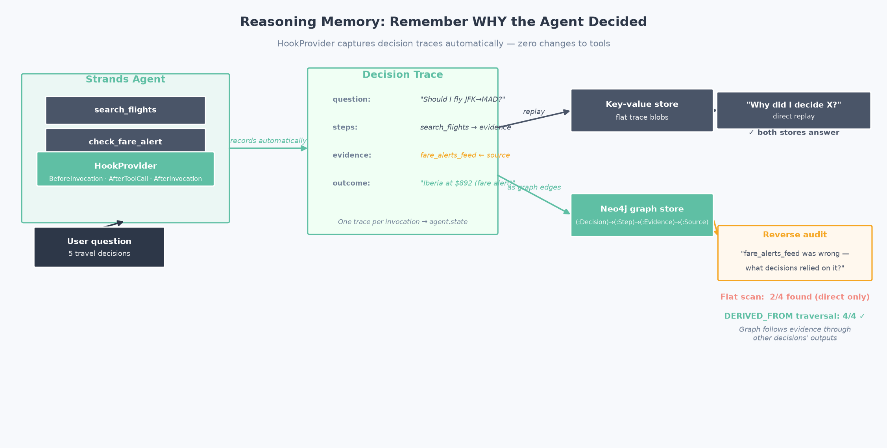
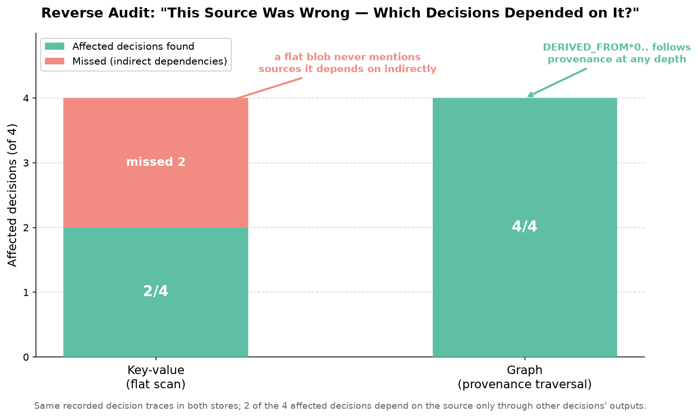

# Reasoning Memory for AI Agents: Remember WHY You Decided

**Problem:** Agent memory stores *what* the agent knows (facts, preferences, history), but not *why it decided*. Ask "why did you recommend X?" a week later and the agent confabulates a plausible justification, because the real reasoning chain was never kept.

**Solution:** Record a **decision trace** (question → tool steps → evidence → outcome, with provenance) automatically, using the agent framework's lifecycle hooks. Zero changes to your tools.

> **Honesty note (read this first):** "reasoning memory" as a named memory type is **not an established category in academic memory taxonomies**. It is an engineering pattern. What the research *does* support is the value of **traceability and provenance** in agent memory (see the papers below). This demo presents the pattern as engineering, not settled science.

> **Assumed familiarity:** builds on the earlier demos (agent state, semantic memory, and, for the graph tests, Demo 03's Neo4j setup). Tests 1-2 need only an OpenAI key; tests 3-4 also need a running Neo4j.

Related research (traceability/provenance theme):
- [MemWeaver: Weaving Hybrid Memories for Traceable Long-Horizon Agentic Reasoning](https://arxiv.org/abs/2601.18204) (Jan 2026)
- [Less Context, More Accuracy: A Bi-Temporal Memory Engine for LLM Agents](https://arxiv.org/abs/2606.09900): the **Engram** system, Jun 2026; every stored fact keeps provenance and a supersession chain. Single-author preprint, cited for the design idea, not as peer-reviewed evidence.

This demo uses [Strands Agents](https://github.com/strands-agents/sdk-python) for the agent harness and [Neo4j](https://neo4j.com/) for the graph track.

> **Official integration.** The graph track wires Neo4j by hand on purpose, to keep the bespoke provenance schema and reverse-audit traversal (`DERIVED_FROM*0..`) visible. For plain graph memory in production, Neo4j Labs ships an official Strands integration, [`neo4j-agent-memory`](https://neo4j.com/labs/agent-memory/how-to/integrations/aws-strands/) (a `Neo4jSessionManager` for `Agent(session_manager=...)`). It is a Neo4j Labs package (community-supported), not part of the Strands SDK core.



---

## What This Demo Shows

### 1. The recorder: traces captured by hooks, not by rewriting tools

A `DecisionTraceRecorder` subscribes to the lifecycle events every Strands agent already emits (invocation start, each tool call, invocation end) and assembles one trace per invocation into `agent.state`:

```python
agent = Agent(
    model=MODEL,
    tools=[search_flights, check_fare_alert],       # unchanged tools
    hooks=[DecisionTraceRecorder()],            # the only addition
)
```

After the agent answers, the trace is just data: `{question, steps: [{tool, input, evidence}], outcome}`. Replaying "why did you recommend Iberia?" returns the **real** chain instead of a reconstruction.

The recorder is a `HookProvider` that subscribes to three lifecycle events the agent already emits: it opens a trace on `BeforeInvocationEvent`, appends one step per `AfterToolCallEvent` (tool, input, evidence), and persists the finished trace to `agent.state` on `AfterInvocationEvent`. It is written out in full in a notebook cell (and kept identically in `trace_kv.py`), because it is the point of the demo rather than a hidden helper.

### 2. The core finding: the reverse audit is where the graph earns its keep

Both stores replay "why did I decide X?" equally well. The question that separates them is the **reverse audit**: *"evidence source S turned out to be wrong: which of my decisions depended on it?"*

The demo seeds 5 decisions; 4 depend on a fare-alerts feed: 2 **directly**, 2 only **through other decisions' outputs** (a budget built on the chosen flights; an itinerary built on that budget). Then the fare-alerts feed is declared compromised:



| Store | Affected decisions found | Why |
|-------|--------------------------|-----|
| **Key-value** (flat scan) | **2/4** | A trace blob only mentions sources it used *directly*; indirect dependencies are invisible to a scan |
| **Graph** (Neo4j traversal) | **4/4** | `DERIVED_FROM*0..` follows the provenance chain at any depth |

The graph also returns the **receipt**: the exact evidence path connecting each decision to the compromised source:

```
trip-itinerary -> trip-itinerary-step-1 -> itinerary-draft -> madrid-fare -> madrid-fare-alert -> fare_alerts_feed
```

All numbers are deterministic checks against a known seeded history: no LLM judge, reproducible.

### Where this fits in memory quality (and where it does not)

Most memory evaluations score four dimensions ([Future AGI, 2026](https://futureagi.com/blogs/ai-agent-memory-evaluation-2026)): **recall** (does it retrieve the right memory), **freshness** (is it up to date), **contradiction handling** (does it resolve conflicts), and **forgetting** (does it drop what it should not keep). Demos 04 and 05 in this series live on those axes.

Reasoning memory is honestly a **different concern**: **provenance and auditability**. It does not make the agent recall more or forget better. It records *why* a decision was made and *what evidence it rested on*, so that later you can answer questions the four dimensions never ask, most importantly the reverse audit. So the metric here is not recall or precision; it is **audit completeness**: given a compromised source, what fraction of the decisions that actually depended on it can you find? Flat storage finds 2/4 (direct citations only); the provenance graph finds 4/4 (any depth). That is the number that matters for this demo, and it is a property no recall/freshness/forgetting score would surface.

---

## Scenarios Demonstrated

| Test | What it does |
|------|--------------|
| **1. No trace** | The agent decides with tools; a later session asked "why?" confabulates: 0 real steps recoverable |
| **2. Recorder** | Same tools + `hooks=[DecisionTraceRecorder()]`; the agent replays its own real chain (2/2 steps) |
| **3. Graph replay** | The same traces as `(:Decision)-[:HAS_STEP]->(:Step)-[:USED]->(:Evidence)` chains in Neo4j |
| **4. Reverse audit** | "The fare-alerts feed was compromised": flat scan finds 2/4 affected decisions, graph traversal 4/4 |

---

## The graph model

```
(:Decision)-[:HAS_STEP]->(:Step)-[:NEXT]->(:Step)     the reasoning chain
(:Step)-[:USED]->(:Evidence)                           what each step relied on
(:Evidence)-[:DERIVED_FROM]->(:Evidence)               evidence built on other evidence
(:Evidence)-[:FROM_SOURCE]->(:Source)                  external origin
```

The reverse audit is one query:

```cypher
MATCH (d:Decision)-[:HAS_STEP]->(:Step)-[:USED]->(:Evidence)
      -[:DERIVED_FROM*0..]->(:Evidence)-[:FROM_SOURCE]->(s:Source {name: $source})
RETURN DISTINCT d
```

The variable-length `DERIVED_FROM*0..` hop is what a flat store cannot express: length 0 covers evidence taken straight from the source, longer paths follow provenance through decisions that only depended on it via other decisions' outputs.

---

## Quick Start

### Prerequisites

```bash
python --version   # Python 3.9+
export OPENAI_API_KEY="your-key-here"
```

Tests 1-2 run with just the OpenAI key. Tests 3-4 also need a running **Neo4j** (Desktop, Docker, or Aura); see Demo 03 for setup options.

**AI Model Provider:** OpenAI by default; swap for [Amazon Bedrock](https://aws.amazon.com/bedrock/?trk=87c4c426-cddf-4799-a299-273337552ad8&sc_channel=el), Anthropic, or Ollama via the model block in `test_reasoning_memory.py`.

### Installation

```bash
uv venv && uv pip install -r requirements.txt
cp .env.example .env   # fill in OPENAI_API_KEY and (for the graph tests) NEO4J_* values
```

### Deterministic vs model-based

The control lives in the agent's harness: the `DecisionTraceRecorder` is a Strands `HookProvider` attached with `Agent(hooks=[...])`. The whole audit track is deterministic code: assembling the trace, the provenance graph, the `DERIVED_FROM*0..` traversal, and the flat scan all reproduce for the same input, which is why the 2/4 vs 4/4 scorecard needs no LLM judge. The one model-based part is upstream, the agent deciding which tools to call; recording and auditing that decision afterwards is deterministic ([research on model non-determinism](https://arxiv.org/abs/2601.17768)).

## Run Demo

```bash
uv run python test_reasoning_memory.py
```

### Cleanup

The graph track creates an isolated Neo4j database (`reasoningdemo`) for the decision, evidence, and source nodes. The script tears it down for you: after the reverse-audit test, `teardown_graph` clears the demo's nodes and then drops the whole database, so nothing this demo created is left behind. The teardown is guarded, so on Neo4j Community (which falls back to the shared default `neo4j` database) it only clears the demo's nodes and never drops the default. The notebook has a matching **Cleanup** cell at the end. The key-value track holds nothing to clean; it lives in memory.

---

## Files

| File | Purpose |
|------|---------|
| `test_reasoning_memory.py` | Main demo: 4 tests + comparison |
| `trace_kv.py` | `DecisionTraceRecorder` (HookProvider) + flat trace store + Strands tools |
| `trace_graph.py` | Traces as Neo4j node chains + the reverse-audit traversal (isolated `reasoningdemo` DB) |
| `test_reasoning_memory.ipynb` | Interactive notebook walkthrough |
| `images/generate_chart.py` | Generates the reverse-audit chart |
| `requirements.txt` | Dependencies |

---

## Key Concepts

### Where decision traces pay off

| Need | Flat store (`agent.state`) | Graph store (Neo4j) |
|------|----------------------------|---------------------|
| "Why did you decide X?" (replay) | ✅ one lookup | ✅ one traversal |
| Persistence across restarts | ✅ works with a session manager | ✅ database |
| "Source S was wrong, what did it touch?" | ⚠️ direct citations only | ✅ any depth, with the evidence path as a receipt |
| Audit trail for regulated domains | ⚠️ per-decision only | ✅ cross-decision provenance |

**Rule of thumb:** if you only ever replay individual decisions, `agent.state` is enough. The graph earns its keep when decisions build on other decisions and you need to audit *across* them.

### Scope and honesty notes

- **Engineering pattern, not settled science.** No academic taxonomy defines "reasoning memory" as a memory type; the demo borrows the *traceability/provenance* theme that recent memory systems (MemWeaver, Engram) do support.
- **The recorder is minimal.** It captures tool calls and final outcomes, not the model's internal chain-of-thought (which providers don't expose reliably and which can be unfaithful). What it records is what actually happened: the tools called, the evidence returned, the outcome produced.
- **Deterministic measurement.** The seeded history fixes the ground truth (4 affected decisions by construction); both audits are checked against it. No LLM judges anything.

---

## Learning Objectives

1. Understand why "what the agent knows" is not enough to answer "why did it decide"
2. Capture decision traces automatically with framework lifecycle hooks (zero tool changes)
3. Replay a real reasoning chain instead of letting the agent confabulate one
4. Model provenance as graph edges and run the reverse audit a flat store can't express
5. Know when the flat store is enough and when the graph is worth the extra moving part

---

## Troubleshooting

| Issue | Solution |
|-------|----------|
| Graph tests: `ServiceUnavailable` | Neo4j isn't running / wrong `NEO4J_URI`. Tests 1-2 still run without Neo4j. |
| `AuthError` | Wrong `NEO4J_USER` / `NEO4J_PASSWORD` in `.env`. |
| Database create fails on Community | Expected. The demo falls back to the default database automatically. |
| Traces missing after a run | The recorder writes at invocation end; check `agent.state.get("decision_traces")` after the call returns. |

**Tested versions:** Strands 1.55.1, `neo4j-graphrag` 1.18.0, `neo4j` driver 6.2.0, Neo4j server 2026.01.3.

---

## References

- [MemWeaver](https://arxiv.org/abs/2601.18204): traceable long-horizon agentic reasoning (Jan 2026)
- [Less Context, More Accuracy (Engram)](https://arxiv.org/abs/2606.09900): provenance + supersession chains in a bi-temporal memory engine (Jun 2026, preprint)

### Framework Documentation

- [Strands Agents SDK](https://github.com/strands-agents/sdk-python)
- [Strands Agents: Hooks](https://strandsagents.com/docs/user-guide/concepts/agents/hooks/?trk=87c4c426-cddf-4799-a299-273337552ad8&sc_channel=el)
- [Neo4j Cypher: variable-length paths](https://neo4j.com/docs/cypher-manual/current/patterns/variable-length-paths/)

---

## Pricing

Tests 1-2 use only the model provider. Tests 3-4 add a Neo4j instance for the provenance graph. Neo4j runs free locally (Desktop or Docker); the managed option (Aura) is billed. Check the current rates:

| Service | Used for | Pricing |
|---------|----------|---------|
| Neo4j Aura | Tests 3-4: managed graph database for the provenance traversal (skip if you run Neo4j locally) | [Neo4j Aura pricing](https://neo4j.com/pricing/) |
| Amazon Bedrock | Optional model provider (swap in place of OpenAI) | [Bedrock pricing](https://aws.amazon.com/bedrock/pricing/?trk=87c4c426-cddf-4799-a299-273337552ad8&sc_channel=el) |
| OpenAI | Default model provider | [OpenAI pricing](https://openai.com/api/pricing/) |

The key-value track runs in-process with no service cost. For an estimate of any AWS usage before you commit spend, use the [AWS Pricing Calculator](https://calculator.aws/?trk=87c4c426-cddf-4799-a299-273337552ad8&sc_channel=el).

---

## Next Steps

1. [Demo 05: Memory Hygiene](../05-memory-hygiene-demo/): what an agent should NOT remember
2. [Demo 03: Graph Memory](../03-graph-memory-demo/): reasoning over relationships

---

## Contributing

Contributions are welcome! See [CONTRIBUTING](../CONTRIBUTING.md) for more information.

---

## Security

If you discover a potential security issue in this project, notify AWS/Amazon Security via the [vulnerability reporting page](https://aws.amazon.com/security/vulnerability-reporting/). Please do **not** create a public GitHub issue.

---

## License

This library is licensed under the MIT-0 License. See the [LICENSE](../LICENSE) file for details.
