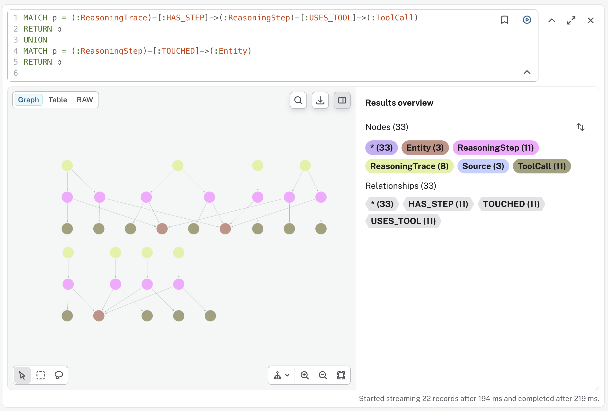

# Reasoning Memory for AI Agents: Remember WHY You Decided

**Problem:** Agent memory stores *what* the agent knows (facts, preferences, history), but not *why it decided*. Ask "why did you recommend X?" a week later and the agent confabulates a plausible justification, because the real reasoning chain was never kept.

**Solution:** Record a **decision trace** (question → reasoning steps → tool calls → touched sources) automatically, using the agent framework's lifecycle hooks. Zero changes to your tools. Everything here is **live**: the agent takes real decisions with real tools, and the recorder captures whatever it actually did. Nothing is hardcoded.

> **What is a "flat" memory?** A store that keeps each record on its own, with no edges to traverse between them: a key-value store, a log file, a vector store. As Neo4j's own teaching puts it, *a flat log records what happened; a graph records why*. The contrast in this demo is a flat trace store (`agent.state`) versus a graph (Neo4j).

> **Honesty note (read this first):** "reasoning memory" as a named memory type is **not an established category in academic memory taxonomies**. It is an engineering pattern. What the research *does* support is the value of **traceability and provenance** in agent memory (see the papers below). This demo presents the pattern as engineering, not settled science.

> **Assumed familiarity:** builds on the earlier demos (agent state, and, for the graph tests, Demo 03's Neo4j setup). Tests 1, 2, and 5 need only an OpenAI key; tests 3-4 also need a running Neo4j.

Related research (traceability/provenance theme):
- [MemWeaver: Weaving Hybrid Memories for Traceable Long-Horizon Agentic Reasoning](https://arxiv.org/abs/2601.18204) (Jan 2026)
- [Less Context, More Accuracy: A Bi-Temporal Memory Engine for LLM Agents](https://arxiv.org/abs/2606.09900): the **Engram** system, Jun 2026; every stored fact keeps provenance and a supersession chain. Single-author preprint, cited for the design idea, not as peer-reviewed evidence.

This demo uses [Strands Agents](https://github.com/strands-agents/sdk-python) for the agent harness and [Neo4j](https://neo4j.com/) for the graph track.

> **The graph track uses Neo4j's official agent-memory SDK.** We do not hand-roll the graph schema. The graph track is built on [`neo4j-agent-memory`](https://neo4j.com/labs/agent-memory/) (Neo4j Labs), the official reasoning-memory SDK, so the schema, the writes, and the audit traversal are Neo4j's, not ours. Its [`Neo4jMemoryStore`](https://neo4j.com/labs/agent-memory/how-to/integrations/aws-strands/) (attached with `MemoryManager(stores=[...])`) is the preferred integration path for plain graph memory; here we use its **reasoning-traces** API directly, because decision traces are exactly what it records. It is a Neo4j Labs package (community-supported), not part of the Strands SDK core.



---

## What This Demo Shows

### 1. The recorder: traces captured by hooks, not by rewriting tools

A `DecisionTraceRecorder` subscribes to the lifecycle events every Strands agent already emits (invocation start, each tool call, invocation end) and assembles one trace per invocation:

```python
agent = Agent(
    model=MODEL,
    tools=[search_flights, check_fare_alert],   # unchanged tools
    hooks=[DecisionTraceRecorder()],            # the only addition
)
```

The recorder is a `HookProvider`: it opens a trace on `BeforeInvocationEvent`, appends one step per `AfterToolCallEvent` (reading `event.tool_use` for the tool name and input), and persists the finished trace on `AfterInvocationEvent`. For the flat track the trace lands in `agent.state`; for the graph track it lands in Neo4j through the official SDK. Ask "why did you recommend that flight?" and it replays the **real** chain instead of a reconstruction, even after a restart (the session manager restores the flat trace; the graph is a database).

The recorder is written out in full in a notebook cell (and kept identically in `trace_kv.py` / `trace_graph.py`), because it is the point of the demo rather than a hidden helper.

### 2. The core finding: the reverse audit is where the graph earns its keep

Both stores replay "why did I decide X?" equally well. The question that separates them is the **reverse audit**: *"evidence source S turned out to be wrong: which of my decisions touched it?"*

The demo runs a live travel-planning session of **ten decisions**: some read a fare-alerts feed (flight picks, fare-alert checks), some read only a weather API (best time to visit, what to pack). Then the fare-alerts feed is declared compromised, and we ask which decisions touched it:

| Store | Reverse audit | Why |
|-------|---------------|-----|
| **Flat** (`agent.state` scan) | reads every record, one at a time | a flat store has no edges; you scan each blob and match on the source it names |
| **Graph** (Neo4j `:TOUCHED` traversal) | one query | the SDK records a `(:ReasoningStep)-[:TOUCHED]->(:Entity)` edge per source, so the audit is a single traversal, at read time |

Of the ten live decisions, the audit finds the **four** that touched `fare_alerts_feed` (the flight picks that checked a fare alert, plus the standalone fare-alert checks) and correctly excludes the weather-only decisions. The exact count depends on what the live agent does each run; the deterministic property is that the traversal returns every decision whose recorded steps touched the source, and nothing else.

### Where this fits in memory quality (and where it does not)

Most memory evaluations score four dimensions ([Future AGI, 2026](https://futureagi.com/blogs/ai-agent-memory-evaluation-2026)): **recall** (does it retrieve the right memory), **freshness** (is it up to date), **contradiction handling** (does it resolve conflicts), and **forgetting** (does it drop what it should not keep). Demos 04 and 05 in this series live on those axes.

Reasoning memory is honestly a **different concern**: **provenance and auditability**. It does not make the agent recall more or forget better. It records *why* a decision was made and *what evidence it rested on*, so that later you can answer questions the four dimensions never ask, most importantly the reverse audit. The graph does not find *more correct* decisions than the flat scan for this small run; both can enumerate the touched sources. What the graph gives you is that the audit is **one traversal the store already supports**, at any depth, instead of application code that re-scans every record and cannot follow a dependency that runs through another decision's output.

---

## Scenarios Demonstrated

| Test | What it does |
|------|--------------|
| **1. No trace** | The agent decides with tools; after a real restart (session restored via a session manager) it is asked "why?" and confabulates: 0 real steps recoverable |
| **2. Recorder** | Same tools + `hooks=[DecisionTraceRecorder()]`; the trace survives the restart and the replay returns the agent's own real chain |
| **3. Graph, live** | The agent takes ten live decisions; each is recorded into Neo4j through the official SDK, with no hardcoded history |
| **4. Reverse audit** | "The fare-alerts feed was compromised, which decisions touched it?" One traversal over the SDK's `:TOUCHED` edges; the weather-only decisions are correctly excluded |
| **5. Why store it** | Replaying "why did I decide X?" from the trace costs 0 model tokens and returns the real chain; asking the model to reconstruct it costs tokens and confabulates. Storing saves tokens and avoids errors. |

---

## The graph model (managed by the SDK, not hand-rolled)

Neo4j's agent-memory SDK creates and manages this schema when the recorder writes a trace:

```
(:ReasoningTrace)-[:HAS_STEP]->(:ReasoningStep)-[:USES_TOOL]->(:ToolCall)-[:INSTANCE_OF]->(:Tool)
(:ReasoningStep)-[:TOUCHED]->(:Entity)
```

The reverse audit is one traversal over the `:TOUCHED` edges:

```cypher
MATCH (t:ReasoningTrace)-[:HAS_STEP]->(:ReasoningStep)
      -[:TOUCHED]->(:Entity {name: "fare_alerts_feed"})
RETURN DISTINCT t.task
```

### See the graph in Neo4j Browser

The graph track uses an isolated database, `reasoningdemo`. In Neo4j Browser, select that database first (`:use reasoningdemo`), run the demo so the traces exist, then paste any of these (they return paths, so the Browser draws the edges):

```cypher
// The whole reasoning graph: each decision's trace, its steps and tool calls,
// and the sources those calls touched.
MATCH p = (:ReasoningTrace)-[:HAS_STEP]->(:ReasoningStep)-[:USES_TOOL]->(:ToolCall)
RETURN p
UNION
MATCH p = (:ReasoningStep)-[:TOUCHED]->(:Entity)
RETURN p
```

```cypher
// Reverse audit: every decision whose steps touched the compromised source.
MATCH p = (:ReasoningTrace)-[:HAS_STEP]->(:ReasoningStep)
          -[:TOUCHED]->(:Entity {name: "fare_alerts_feed"})
RETURN p
```

```cypher
// One decision end to end: its steps, tools, and touched sources.
MATCH p = (t:ReasoningTrace)-[*1..3]-()
WHERE t.task CONTAINS "Madrid"
RETURN p
```

These same three queries are available in code as `trace_graph.VISUALIZE_QUERIES`.

---

## Quick Start

### Prerequisites

```bash
python --version   # Python 3.9+
export OPENAI_API_KEY="your-key-here"
```

Tests 1, 2, and 5 run with just the OpenAI key. Tests 3-4 also need a running **Neo4j** (Desktop, Docker, or Aura); see Demo 03 for setup options.

**AI Model Provider:** OpenAI by default; swap for [Amazon Bedrock](https://aws.amazon.com/bedrock/?trk=87c4c426-cddf-4799-a299-273337552ad8&sc_channel=el), Anthropic, or Ollama via the model block in `test_reasoning_memory.py`.

### Installation

```bash
uv venv && uv pip install -r requirements.txt
cp .env.example .env   # fill in OPENAI_API_KEY and (for the graph tests) NEO4J_* values
```

### Deterministic vs model-based

The control lives in the agent's harness: the `DecisionTraceRecorder` is a Strands `HookProvider` attached with `Agent(hooks=[...])`. Recording and auditing are deterministic: assembling the trace from lifecycle events, the SDK's writes, and the `:TOUCHED` traversal all return the same result for the same recorded input. The one model-based part is upstream, the agent deciding which tools to call on each prompt; that carries no reproducibility guarantee ([research on model non-determinism](https://arxiv.org/abs/2601.17768)). So the *set* of decisions can vary run to run, but the audit over whatever was recorded is exact.

## Run Demo

```bash
uv run python test_reasoning_memory.py
```

### Talk to the agents directly

`chat_test.py` lets you drive each track from the terminal, outside the notebook:

```bash
uv run python chat_test.py --flat     # records into agent.state, ask "why did you...?"
uv run python chat_test.py --graph    # records into Neo4j via the official SDK
```

### Cleanup

The graph track creates an isolated Neo4j database (`reasoningdemo`) so the SDK's vector indexes never collide with the 1024-dim indexes the other demos use. The script tears it down for you: after the reverse-audit test, `teardown_database()` drops the whole database, so nothing this demo created is left behind. The teardown is guarded by a name check, and the notebook has a matching **Cleanup** cell. The flat track holds nothing to clean; it lives in `agent.state`.

---

## Files

| File | Purpose |
|------|---------|
| `test_reasoning_memory.py` | Main demo: 5 tests (flat track + live graph track + tokens) |
| `trace_kv.py` | `DecisionTraceRecorder` (HookProvider) + flat trace store + the live Strands tools |
| `trace_graph.py` | `Neo4jDecisionRecorder` (HookProvider) writing live traces via the official SDK + the `:TOUCHED` reverse-audit traversal + Browser queries (isolated `reasoningdemo` DB) |
| `chat_test.py` | Talk to either track from the terminal (`--flat` / `--graph`) |
| `test_reasoning_memory.ipynb` | Interactive notebook walkthrough |
| `flights_api.py` / `weather_api.py` | Real data sources the tools read (Duffel offers, Open-Meteo climate) |
| `requirements.txt` | Dependencies |

---

## Key Concepts

### Where decision traces pay off

| Need | Flat store (`agent.state`) | Graph store (Neo4j) |
|------|----------------------------|---------------------|
| "Why did you decide X?" (replay) | ✅ one lookup | ✅ one traversal |
| Persistence across restarts | ✅ works with a session manager | ✅ database |
| "Source S was wrong, what touched it?" | ⚠️ scan every record; can't follow a dependency through another decision's output | ✅ one `:TOUCHED` traversal, at any depth |
| Audit trail for regulated domains | ⚠️ per-decision only | ✅ cross-decision provenance |

**Rule of thumb:** if you only ever replay individual decisions, `agent.state` is enough. The graph earns its keep when decisions build on other decisions and you need to audit *across* them.

### A note on privacy: showing the reasoning is not always safe

Being able to replay *why* the agent decided is useful for audits, but the same trace can leak private data: the tools it called, the inputs it passed (a user's route, dates, budget), and the evidence it read. Treat a decision trace as sensitive:

- **Screen what goes into the trace** the same way Demo 05 screens what goes into memory: a write-gate / PII check before the step is stored. Amazon Comprehend can [detect and redact PII](https://docs.aws.amazon.com/comprehend/latest/dg/how-pii.html?trk=87c4c426-cddf-4799-a299-273337552ad8&sc_channel=el) in the inputs and evidence before they are recorded.
- **Scope the store by tenant / user**, so a "why did *I* decide X?" replay can only ever read that user's own traces.
- **Gate who can replay.** "Show me the reasoning" is an audit capability, not a default user affordance; put it behind the same authorization as any other audit log.

Neo4j documents [access control and auditing](https://neo4j.com/docs/operations-manual/current/authentication-authorization/) for the graph side.

### Scope and honesty notes

- **Engineering pattern, not settled science.** No academic taxonomy defines "reasoning memory" as a memory type; the demo borrows the *traceability/provenance* theme that recent memory systems (MemWeaver, Engram) do support.
- **The recorder is minimal.** It captures tool calls and final outcomes, not the model's internal chain-of-thought (which providers don't expose reliably and which can be unfaithful). What it records is what actually happened: the tools called, the sources touched, the outcome produced.
- **Live, not seeded.** The traces come from the agent's real tool calls on each prompt. The audit is exact over whatever was recorded; the set of decisions can differ run to run because the deciding is a model call.

### Optional: the same hooks, the other direction (caching)

This demo *audits* reasoning after the fact. The companion repo [stop-paying-for-repeated-llm-calls-sample-for-aws](https://github.com/elizabethfuentes12/stop-paying-for-repeated-llm-calls-sample-for-aws) *reuses* it: its `ReasoningCache` is a Strands `HookProvider` too, but it runs both directions, `BeforeInvocationEvent` injects a past plan for a similar task (skipping the model round-trip), and `AfterInvocationEvent` stores the new trajectory. Same events, opposite goal: here we record to *ask why later*, there they record to *avoid re-deciding*. If replaying a stored trace to save tokens (Test 5) interests you, that repo takes it all the way (AWS benchmark: 86% lower cost, 88% lower latency).

---

## Learning Objectives

1. Understand why "what the agent knows" is not enough to answer "why did it decide"
2. Capture decision traces automatically with framework lifecycle hooks (zero tool changes)
3. Replay a real reasoning chain instead of letting the agent confabulate one
4. Record traces into Neo4j with the official SDK and run the `:TOUCHED` reverse audit a flat store can't express in one query
5. Know when the flat store is enough and when the graph is worth the extra moving part

---

## Troubleshooting

| Issue | Solution |
|-------|----------|
| Graph tests: `ServiceUnavailable` | Neo4j isn't running / wrong `NEO4J_URI`. Tests 1, 2, 5 still run without Neo4j. |
| `AuthError` | Wrong `NEO4J_USER` / `NEO4J_PASSWORD` in `.env`. |
| Embedding dimension mismatch | The SDK builds 1536-dim indexes; the isolated `reasoningdemo` database keeps them from colliding with the other demos' 1024-dim indexes. Don't point it at a database another demo already used. |
| `HAS_STEP does not exist` warning on first query | Harmless: the SDK runs its internal queries before any trace has been written. |
| Traces missing after a run | The recorder writes at invocation end; check `agent.state.get("decision_traces")` (flat) or the `reasoningdemo` database (graph) after the call returns. |

**Tested versions:** Strands 1.55.1, `neo4j-agent-memory` 0.6.0, `neo4j` driver 6.2.0, Neo4j server 2026.01.3.

---

## References

- [MemWeaver](https://arxiv.org/abs/2601.18204): traceable long-horizon agentic reasoning (Jan 2026)
- [Less Context, More Accuracy (Engram)](https://arxiv.org/abs/2606.09900): provenance + supersession chains in a bi-temporal memory engine (Jun 2026, preprint)

### Framework Documentation

- [Strands Agents SDK](https://github.com/strands-agents/sdk-python)
- [Strands Agents: Hooks](https://strandsagents.com/docs/user-guide/concepts/agents/hooks/?trk=87c4c426-cddf-4799-a299-273337552ad8&sc_channel=el)
- [Neo4j agent-memory: reasoning traces](https://neo4j.com/labs/agent-memory/how-to/reasoning-traces/)
- [Neo4j agent-memory: AWS Strands integration](https://neo4j.com/labs/agent-memory/how-to/integrations/aws-strands/)

---

## Pricing

Tests 1, 2, 5 use only the model provider. Tests 3-4 add a Neo4j instance for the reasoning graph. Neo4j runs free locally (Desktop or Docker); the managed option (Aura) is billed. Check the current rates:

| Service | Used for | Pricing |
|---------|----------|---------|
| Neo4j Aura | Tests 3-4: managed graph database for the reasoning traces (skip if you run Neo4j locally) | [Neo4j Aura pricing](https://neo4j.com/pricing/) |
| Amazon Bedrock | Optional model provider (swap in place of OpenAI) | [Bedrock pricing](https://aws.amazon.com/bedrock/pricing/?trk=87c4c426-cddf-4799-a299-273337552ad8&sc_channel=el) |
| OpenAI | Default model provider | [OpenAI pricing](https://openai.com/api/pricing/) |

The flat track runs in-process with no service cost. For an estimate of any AWS usage before you commit spend, use the [AWS Pricing Calculator](https://calculator.aws/?trk=87c4c426-cddf-4799-a299-273337552ad8&sc_channel=el).

---

## Next Steps

1. [Demo 05: Memory Hygiene](../05-memory-hygiene-demo/): what an agent should NOT remember
2. [Demo 03: Graph Memory](../03-graph-memory-demo/): reasoning over relationships

---

## Contributing

Contributions are welcome! See [CONTRIBUTING](../CONTRIBUTING.md) for more information.

---

## Security

If you discover a potential security issue in this project, notify AWS/Amazon Security via the [vulnerability reporting page](https://aws.amazon.com/security/vulnerability-reporting/). Please do **not** create a public GitHub issue.

---

## License

This library is licensed under the MIT-0 License. See the [LICENSE](../LICENSE) file for details.
